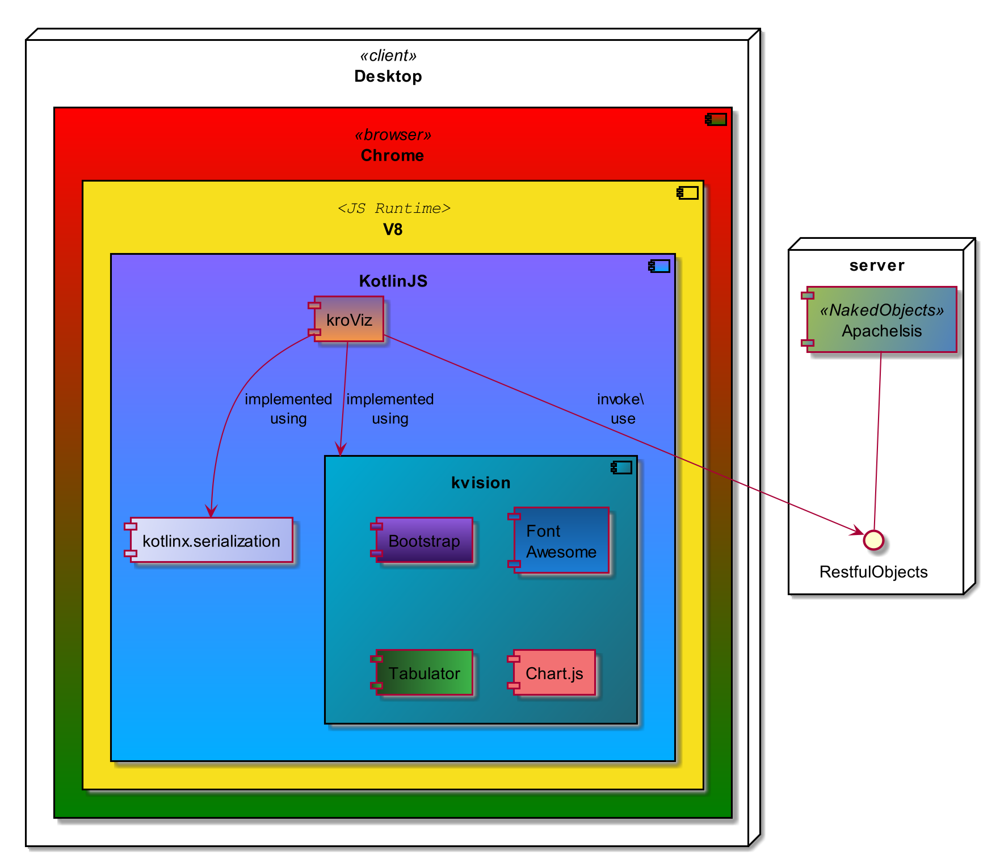
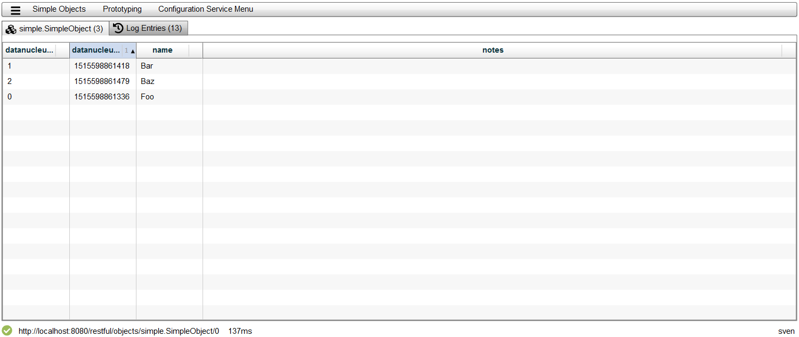
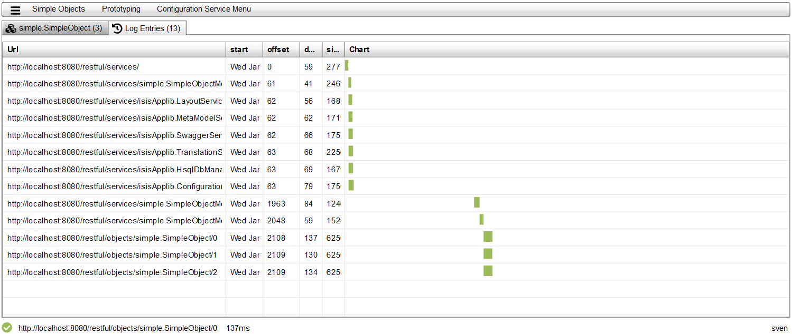
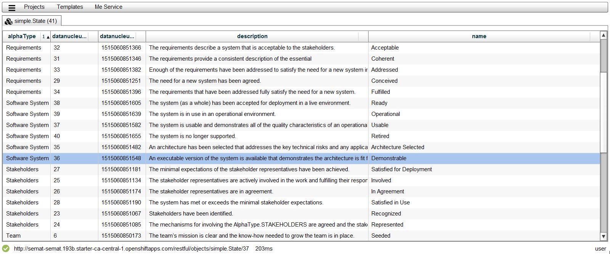

# kroViz 
(to be pronounced: [krous]) is a viewer for [Restful Objects](http://www.restfulobjects.org) written in [Kotlin/JS](https://github.com/JetBrains/kotlin/tree/master/js), using [kvision](https://rjaros.github.io/kvision) for the UI part. 

## About

kroViz is a generic client for applications that implement the Restful Objects Specification, namely:

* [Apache Isis](https://isis.apache.org/)
* [Naked Objects for .NET](http://nakedobjects.net/home/index.shtml)

In order to see it working, setup a server with an [Apache Isis](https://isis.apache.org/) application with the restful objects interface enabled 
[SimpleApp](https://github.com/apache/isis/tree/master/example/application/simpleapp), [ToDoApp](https://github.com/isisaddons/isis-app-todoapp), 
etc. See [setup instructions](./docs/DevelopmentGuide.md#setup-the-back-end). 

A [Naked Objects for .NET](http://nakedobjects.net/home/index.shtml) application should work as well, but is not tested yet.

## User Interface

The GUI will be similar to the well known Wicket-UI of Apache Isis, but will make use of Tabs for Lists and Objects instead of Bookmarking URLs.
The table widget allows filtering/sorting on the client and scrolling behavior will be more like in traditional Desktop applications.  

In the left upper corner you will find a burger icon with an drop down menu. Click and select -> Connect, edit/confirm the settings and press OK.
The menu gets populated. 

* Prototyping -> runFixtureScript
* SimpleObjects -> listAll
* Configuration -> configuration

'Burger' -> Log Entries  creates another tab showing logged XmlHttpRequests:

TIP: Remote applications (here: [SEMAT](http://semat.ofbizian.com/)) can be used as well, and even mixed with local apps. 

# Contributing
Contributions are welcome! Especially:
* fixing Travis build
* bug reports
* code review
* tests increasing the code coverage
* documentation improvements
* feature requests
* comments regarding usability

The contribution workflow is analogous to that of Apache Isis (see: [Contributing](https://isis.apache.org/guides/dg/dg.html#_dg_contributing)), 
except for issues use GitHub instead of JIRA.

