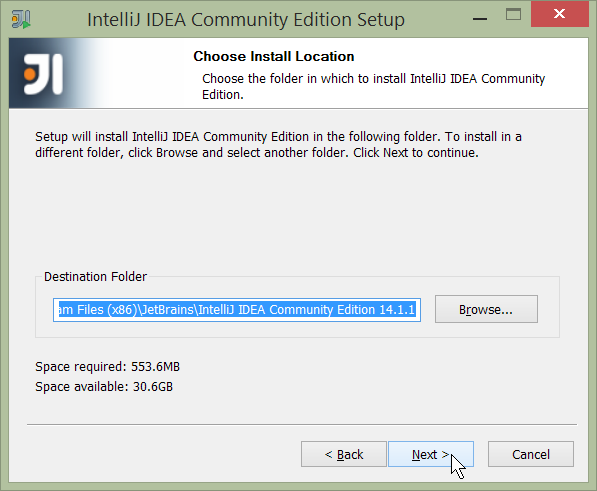
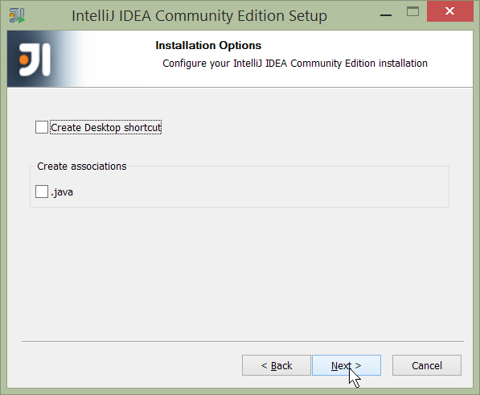
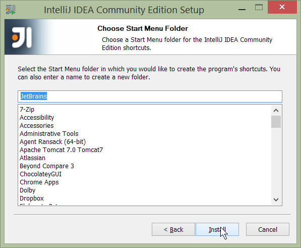
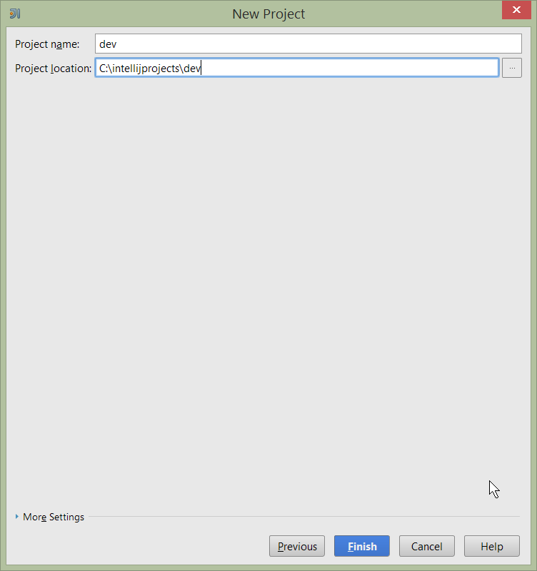
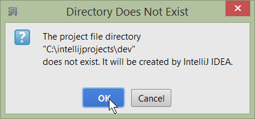
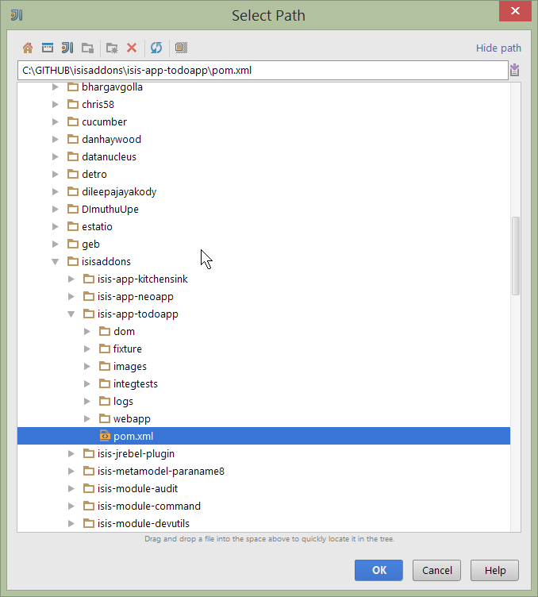
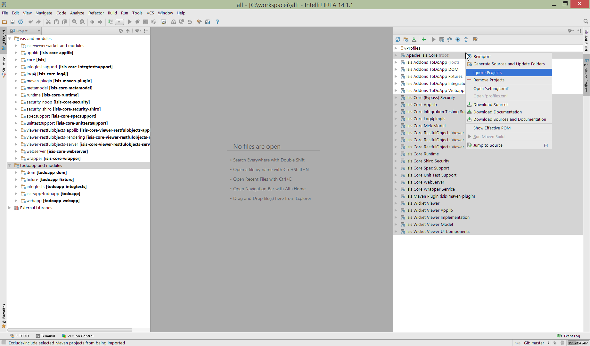

:Notice: Licensed to the Apache Software Foundation (ASF) under one or more contributor license agreements. See the NOTICE file distributed with this work for additional information regarding copyright ownership. The ASF licenses this file to you under the Apache License, Version 2.0 (the "License"); you may not use this file except in compliance with the License. You may obtain a copy of the License at. http://www.apache.org/licenses/LICENSE-2.0 . Unless required by applicable law or agreed to in writing, software distributed under the License is distributed on an "AS IS" BASIS, WITHOUT WARRANTIES OR  CONDITIONS OF ANY KIND, either express or implied. See the License for the specific language governing permissions and limitations under the License.
:_basedir: ../../

#### Setting up IntelliJ (Community Edition)

NOTE: This doc used IntelliJ CE 14.1.1, with screenshots taken for Windows.  If you're a MacOS user, I'm sure you can adapt :-)

##### Download and Install

https://www.jetbrains.com/idea/download/[Download] latest version of IntelliJ Community Edition, and install:

Start the wizard, click through the welcome page:

.IntelliJ Installation Wizard - Welcome page
image::images/intellij-idea/010-installing/010-welcome-page.png[width="400px"]

Choose the location to install the IDE:

.IntelliJ Installation Wizard - Choose Location

Adjust any installation options as you prefer:

.IntelliJ Installation Wizard - Installation Options

and the start menu:

.IntelliJ Installation Wizard - Start Menu Folder

and finish up the wizard:

.IntelliJ Installation Wizard - Completing the Wizard
image::images/intellij-idea/010-installing/050-completing.png[width="400px"]

Later on we'll specify the Apache Isis/ASF code style settings, so for now select `I do not want to import settings`:

.IntelliJ Installation Wizard - Import Settings
image::images/intellij-idea/010-installing/060-import-settings-or-not.png[width="400px"]

Finally, if you are young and trendy, set the UI theme to Darcula:

.IntelliJ Installation Wizard Set UI Theme
image::images/intellij-idea/010-installing/070-set-ui-theme.png[width="600px"]

##### New Project

In IntelliJ a project can contain multiple modules; these need not be physically located together.  (If you are previously an Eclipse user, it is therefore similar to an Eclipse workspace).

Start off by creating a new project:

.IntelliJ Create New Project
image::images/intellij-idea/020-create-new-project/010-new-project-create.png[width="400px"]

We want to create a new *Java* project:

.IntelliJ Create New Project - Create a Java project
image::images/intellij-idea/020-create-new-project/020-java-project-setup-jdk.png[width="600px"]

We therefore need to specify the JDK.

NOTE: at the time of writing Isis supports only Java 7; Java 8 is scheduled for support in Isis v1.9.0

.IntelliJ Create New Java Project - Select the JDK
image::images/intellij-idea/020-create-new-project/030-java-project-select-jdk.png[width="300px"]

Specify the directory containing the JDK:

.IntelliJ Create New Project - Select the JDK location

Finally allow IntelliJ to create the directory for the new project:

.IntelliJ Create New Project

##### Import Settings

Next we need to configure IntelliJ with ASF/Apache Isis' standard templates and coding conventions.  These are bundled as the `isis-settings.jar` JAR file (available from the Isis website).

Import using: `File > Import Settings`, and specify the directory that you have downloaded the file to:

.IntelliJ Import Settings - Specify JAR file
image::images/intellij-idea/030-import-settings/010-settings-import-jar.png[width="400px"]

Select all the (two) categories of settings available in the JAR file:

.IntelliJ Import Settings - Select all categories
image::images/intellij-idea/030-import-settings/020-select-all.png[width="300px"]

And then restart:

.IntelliJ Import Settings - Restart
image::images/intellij-idea/030-import-settings/030-restart.png[width="200px"]

##### Other Settings

There are also some other miscellaneous settings that we recommend that you adjust.

First, specify an up-to-date Maven installation, using `File > Settings` (or `IntelliJ > Preferences` if on MacOS):

.IntelliJ Import Settings - Maven Installation
image::images/intellij-idea/040-other-settings/010-maven-installation.png[width="600px"]

Still on the Maven settings page, configure as follows:

.IntelliJ Import Settings - Maven Configuration
image::images/intellij-idea/040-other-settings/020-maven-configuration.png[width="600px"]

And on the compiler settings page, ensure that `build automatically` is enabled (and optionally `compile independent modules in parallel`):

.IntelliJ Import Settings - Compiler Settings
image::images/intellij-idea/040-other-settings/030-build-automatically.png[width="600px"]

##### Some Plugins

Next, you might want to set up some additional plugins, using `File > Settings > Plugins` (or equivalently `File > Other Settings > Configure Plugins`).

Some to get you started are:

.IntelliJ Plugins
image::images/intellij-idea/050-some-plugins/020-some-plugins-confirmation.png[width="400px"]

##### Importing and Managing Maven Modules

Finally, let's load in some actual code!  We do this by importing the Maven modules.

First up, open up the Maven tool window (`View > Tool Windows > Maven Projects`).  You can then use the 'plus' button to add Maven modules.  In the screenshot you can see we've loaded in Isis core; the modules are listed in the _Maven Projects_ window and corresponding (IntelliJ) modules are shown in the _Projects_ window:

.IntelliJ Maven Module Management - Importing Maven modules
image::images/intellij-idea/100-maven-module-mgmt/010-maven-modules-view.png[width="730px"]

We can then import another module (from some other directory).  For example, here we are importing the Isis Addons' todoapp example:

.IntelliJ Maven Module Management - Importing another Module

You should then see the new Maven module loaded in the _Projects_ window and also the _Maven Projects_ window:

.IntelliJ Maven Module Management -
image::images/intellij-idea/100-maven-module-mgmt/030-other-module-added.png[width="730px"]

If any dependencies are already loaded in the project, then IntelliJ will automatically update the CLASSPATH to resolve to locally held modules (rather from `.m2/repository` folder).  So, for example (assuming that the `<version>` is correct, of course), the Isis todoapp will have local dependencies on the Isis core.

You can press F4 (or use `File > Project Structure`) to see the resolved classpath for any of the modules loaded into the project.

If you want to focus on one set of code (eg the Isis todoapp but not Isis core) then you _could_ remove the module; but better is to ignore those modules.  This will remove from the the _Projects_ window but keep them available in the _Maven Projects_ window for when you next want to work on them:

.IntelliJ Maven Module Management - Ignoring Modules

Confirm that it's ok to ignore these modules:

.IntelliJ Maven Module Management -
image::images/intellij-idea/100-maven-module-mgmt/050-ignoring-modules-2.png[width="300px"]

All being well you should see that the _Projects_ window now only contains the code you are working on.  Its classpath dependencies will be adjusted (eg to resolve to Isis core from `.m2/repository`):

.IntelliJ Maven Module Management -
image::images/intellij-idea/100-maven-module-mgmt/060-ignored-modules.png[width="730px"]

