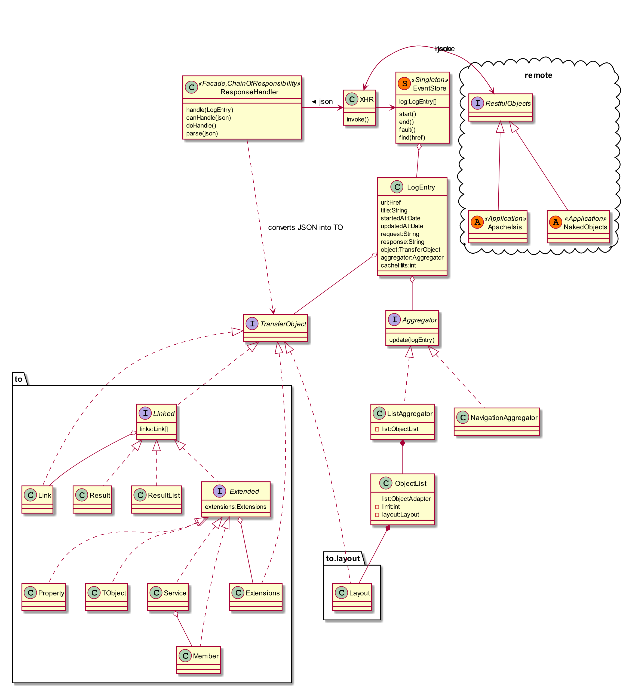
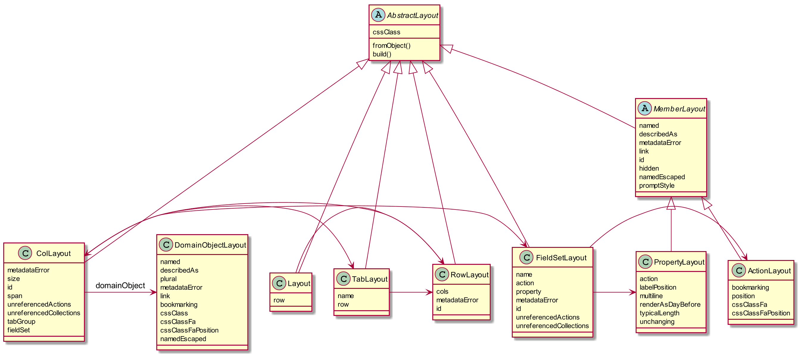
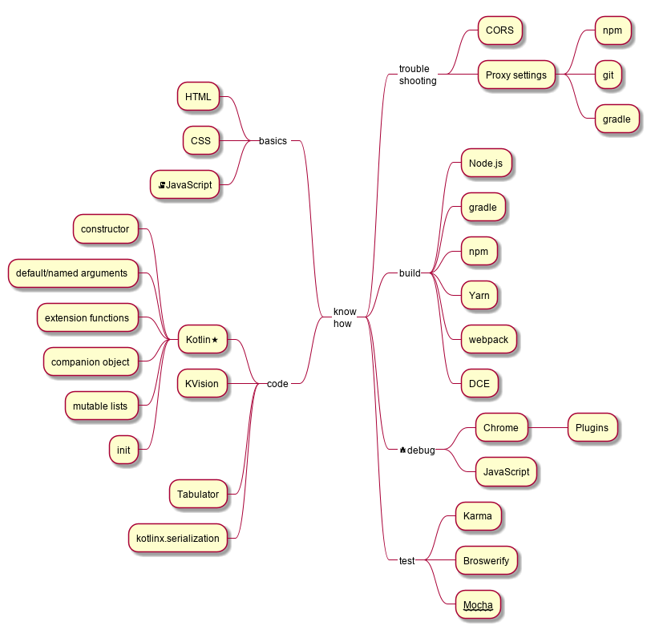

# Patterns 
## Transfer Object (JEE / EAA)
TO's are created from JSON responses
## Event Sourcing (EAA)
Requests, reponses, and resulting TO's are logged. 
Before requests are sent out to the server this log is consulted and used as a cache.
## Proxy (GOF)
The event source acts as a Proxy and thereby saves time and bandwidth.
## Aggregator (EAI)
Various aggregators are responsible to collect or assemble displayable objects.
Once all layout information is there, the UI will be rendered, even if not all elements of a list 
have arrived. Those elements will be added as they arrive. This is done with the help of
mutable lists. 
## Chain of Responsibility (GOF)
A chain of handlers is used to identify what kind of TO is to be generated from the 
JSON response. Handlers are responsible for initial assignment of aggregators.
## Template Method (GOF)
The Handler base class makes use of this pattern. Some methods have to be implemented
in each subsclass, in some cases the default implementation in the base class is used.
## Composite Pattern (GOF)
UI elements are hierarchically grouped, cf. *layout.xml
## Factory (GOF)
Used for building tables dynamically.
## Remote Facade
The Restful Objects API.
## Redux
The implementaion here is an (independent) reinvention of Redux. 
I prefer the name Aggregator over Reducer though - IIRC it's even older.
## Half Object Protocol
The HOP pattern dates back to the early 2000, namely CanooULC.
IMO Naked Objects together with the PO API and kroViz resembles something similar.

# Design
## Overview

## TransferObjects

## Handler Chain

## Layout



# Toolchain
When you are accustomed to the well settled Java ecosystem with integrated development environments, prepare yourself for learning new tools and addressing new problems.

Kotlin is straightforward and once you now it, you may not want to go back.



# Setup the Back-end
## Toolchain Requirements
* (Oracle) JDK 1.8_181 (or higher)
* Apache Maven 3.6.0


## Create a Sample Backend 
Create from the Apache Isis SimpleApp archetype:
```bash
mvn archetype:generate \
    -D archetypeGroupId=org.apache.isis.archetype \
    -D archetypeArtifactId=simpleapp-archetype \
    -D archetypeVersion=2.0.0-M2 \
    -D groupId=org.my \ 
    -D artifactId=myapp-2.0.0-M2 \ 
    -D version=1.0.0 -B
```
Build via
```bash
mvn clean install -DskipTests
```

## Dealing with CORS

Nicely done introduction: 
* https://www.moesif.com/blog/technical/cors/Authoritative-Guide-to-CORS-Cross-Origin-Resource-Sharing-for-REST-APIs/#how-is-origin-definedhttps://www.moesif.com/blog/technical/cors/Authoritative-Guide-to-CORS-Cross-Origin-Resource-Sharing-for-REST-APIs/#how-is-origin-defined

### Amend web.xml 

Add to webapp\src\main\webapp\WEB-INF\web.xml

```xml
	 	<!-- CORS filter for XmlHttpRequests -->
	<filter>
		<filter-name>cross-origin</filter-name>
		<filter-class>org.eclipse.jetty.servlets.CrossOriginFilter</filter-class>
		<init-param>
			<param-name>allowedOrigins</param-name>
			<param-value>*</param-value>
		</init-param>
		<init-param>
			<param-name>allowedMethods</param-name>
			<value>*</value>
		</init-param>
		<init-param>
			<param-name>allowedHeaders</param-name>
			<param-value>*</param-value>
		</init-param>
		<init-param>
			<param-name>supportsCredentials</param-name>
			<param-value>true</param-value>
		</init-param>
		<init-param>
			<param-name>chainPreflight</param-name>
			<param-value>false</param-value>
		</init-param>
	</filter>
	<filter-mapping>
		<filter-name>cross-origin</filter-name>
		<url-pattern>/restful/*</url-pattern>
	</filter-mapping>
```

##Put into webapp/src/main/webapp/WEB-INF/lib
* https://search.maven.org/artifact/org.eclipse.jetty/jetty-util/9.4.12.v20180830/jar
* https://search.maven.org/artifact/org.eclipse.jetty/jetty-servlets/9.4.12.v20180830/jar

## Start the Backend
```bash
cd webapp
mvn -Djetty.port=8080 jetty:run -DPROTOTYPING
```

# Build the Front-end
## Build
Build is done via gradle - under Windows with gitbash:

* ./gradlew.bat tasks # list all gradle tasks
* ./gradlew.bat webpack-bundle # create main.bundle.js
* ./gradlew.bat test --exclude-task npm-install
 
Internally gradle uses npm for the JS part.

 npm --verbose 
 
 If task npm-install hangs, try
 
 ./gradlew.bat npm-install --info --debug --stacktrace
 

Helps in identifying thing that may go wrong (eg. due to proxy settings).
 


## Setup
proxy settings:
https://jjasonclark.com/how-to-setup-node-behind-web-proxy/
https://gist.github.com/EudesSilva/0329645b9c258e0495544b8a5ccd1454


# Toolchain
* node js (https://nodejs.org/en/download/current/)
* Apache Gradle 
* Google Chrome (72.0.3626.81)
* Moesif CORS Plugin (for Chrome)

Kotlin/JS uses `Gradle` for the build, for the JS runtime `NodeJS`, and for the JS dependency management part `npm`.

Depending on the network you are in, you may need to configure the proxy settings. Among the relevant files are:
```bash
~/.npmrc
~/.gitconfig
~/.ssh/config
~/.ssh/id_rsa
```
### Access to git from npm
#### Problem
```bash
npm ERR! Error while executing:
npm ERR! C:\Program Files\Git\bin\git.EXE ls-remote -h -t ssh://git@github.com/jarecsni/font-awesome-webpack.git
npm ERR!
npm ERR! git@ssh.github.com: Permission denied (publickey).
npm ERR! fatal: Could not read from remote repository.
npm ERR!
npm ERR! Please make sure you have the correct access rights
npm ERR! and the repository exists.
npm ERR!
npm ERR! exited with error code: 128
```
#### Solution
`~/.ssh/config`
```bash
ProxyCommand /bin/connect.exe -H proxy.server.name:3128 %h %p

Host github.com
  User git
  Port 22
  Hostname github.com
  IdentityFile "C:\users\username\.ssh\id_rsa"
  TCPKeepAlive yes
  IdentitiesOnly yes

Host ssh.github.com
  User git
  Port 443
  Hostname ssh.github.com
  IdentityFile "C:\users\username\.ssh\id_rsa"
  TCPKeepAlive yes
  IdentitiesOnly yes
```

#### Corporate Firewall with SSL 'inspection'
There are some questionable setups in coporate settings that are based on SSL replacement.
In order to cope with it, you may try to import the Certificate into cacerts, 
see https://intellij-support.jetbrains.com/hc/en-us/community/posts/115000094584-IDEA-Ultimate-2016-3-4-throwing-unable-to-find-valid-certification-path-to-requested-target-when-trying-to-refresh-gradle

### Karma-Tests do not respond to code changes 

Windows:
```
taskkill /f /im node.exe 
```

Linux:
```
killall node 
