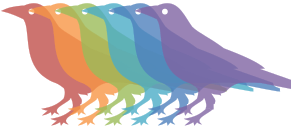
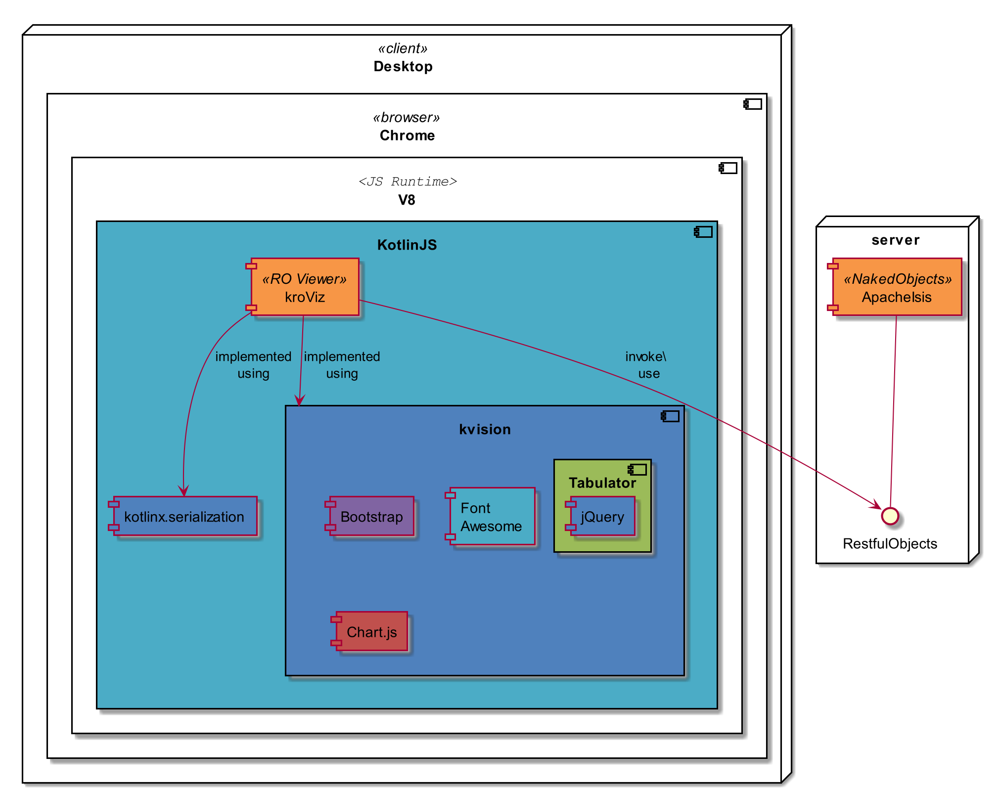
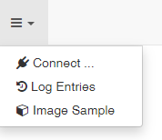
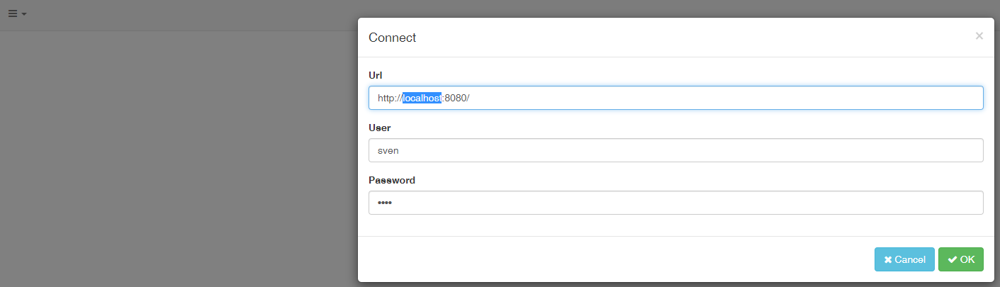
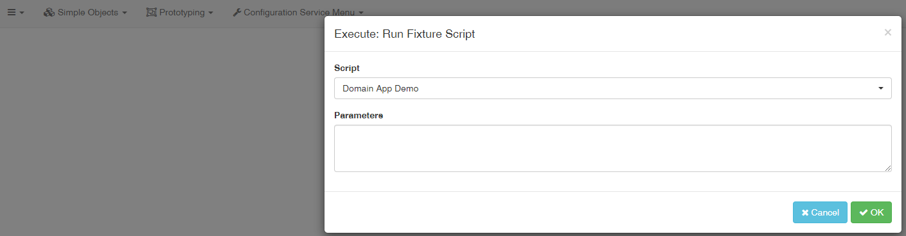
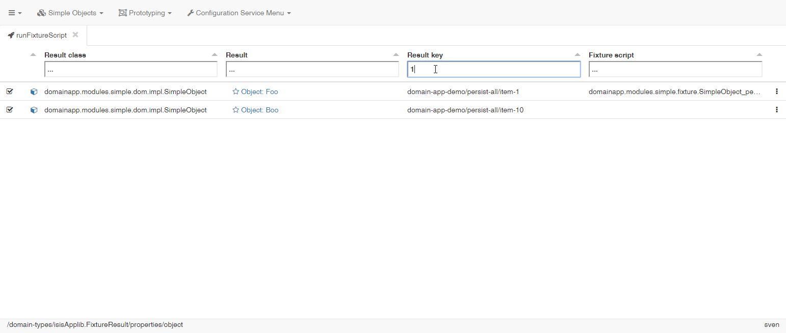
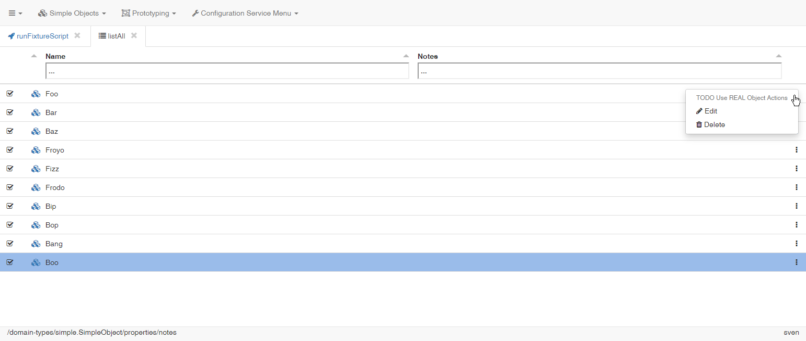

<!--
Notice: Licensed to the Apache Software Foundation (ASF) under one or more contributor license agreements. See the NOTICE file distributed with this work for additional information regarding copyright ownership. The ASF licenses this file to you under the Apache License, Version 2.0 (the "License"); you may not use this file except in compliance with the License. You may obtain a copy of the License at. http://www.apache.org/licenses/LICENSE-2.0 . Unless required by applicable law or agreed to in writing, software distributed under the License is distributed on an "AS IS" BASIS, WITHOUT WARRANTIES OR  CONDITIONS OF ANY KIND, either express or implied. See the License for the specific language governing permissions and limitations under the License.
-->

# kroviz 
(to be pronounced: [krous]) is a viewer for [Restful Objects](http://www.restfulobjects.org) written in [Kotlin/JS](https://github.com/JetBrains/kotlin/tree/master/js), using [KVision](https://rjaros.github.io/kvision) for the UI part. 

## About

kroviz is a generic client for applications that implement the Restful Objects Specification, namely:

* [Apache Causeway](https://causeway.apache.org/)
* [Naked Objects for .NET](http://nakedobjects.net/home/index.shtml)

In order to see it working, setup a server with an [Apache Causeway](https://causeway.apache.org/) application with the restful objects interface enabled 
[SimpleApp](https://github.com/apache/causeway/tree/master/example/application/simpleapp), [ToDoApp](https://github.com/causewayaddons/causeway-app-todoapp), 
etc. See [setup instructions](./docs/DevelopmentGuide.md#setup-the-back-end). 

A [Naked Objects for .NET](http://nakedobjects.net/home/index.shtml) application should work as well, but is not tested yet.

## User Interface

The GUI will be similar to the well known Wicket-UI of Apache Causeway, but will make use of Tabs for Lists and Objects instead of Bookmarking URLs.
The table widget allows filtering/sorting on the client and scrolling behavior will be more like in traditional desktop applications.  

In the left upper corner you will find a burger icon with an drop down menu. Click and select -> Connect, edit/confirm the settings and press OK.

The default url is localhost:8080/

The menu gets populated and you may select Prototyping -> runFixtureScript:

In order to filter the list, enter a string:

Other lists work the same way, eg. SimpleObjects -> listAll:

Clicking on the icon with three dots on the right will open a context menu:

'Burger' -> Log Entries  creates another tab showing logged XmlHttpRequests, sorted by number of 'cache hits'.

Not only XHR's are logged, but 'screen events' as well (filtered for type VIEW)

# Contributing
Contributions are welcome! Especially:
* bug reports
* code review
* tests increasing the code coverage
* documentation improvements
* feature requests
* comments regarding usability
