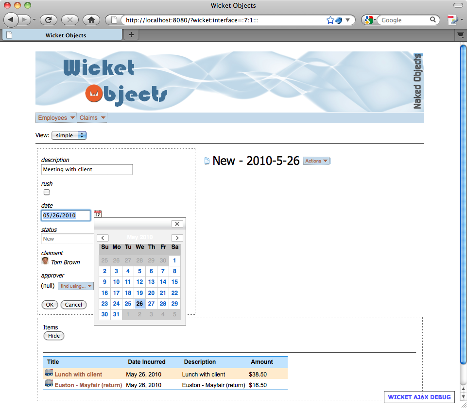
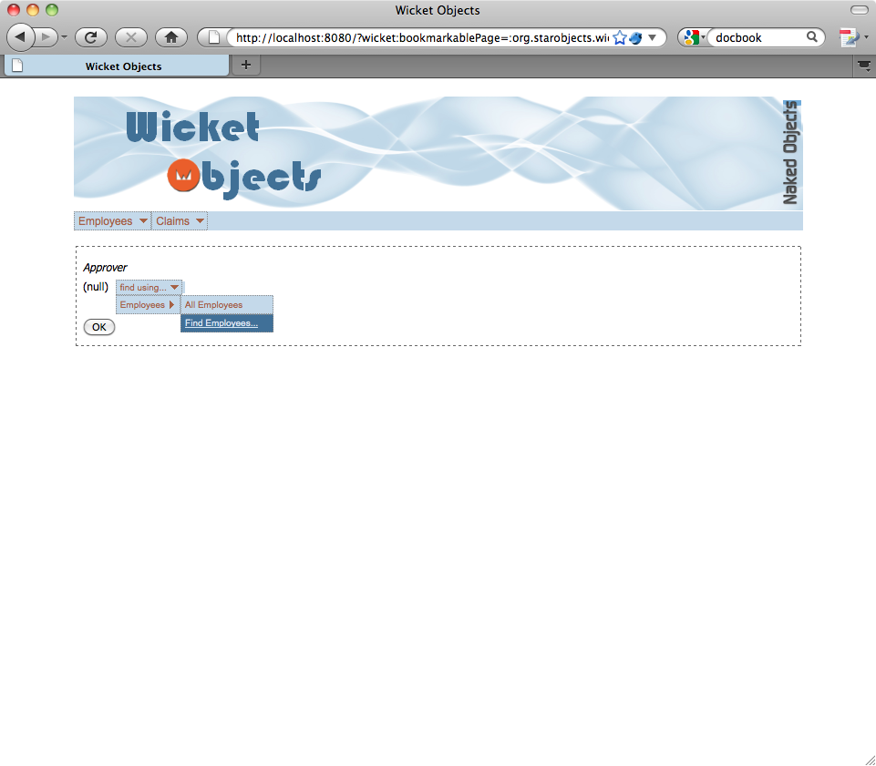
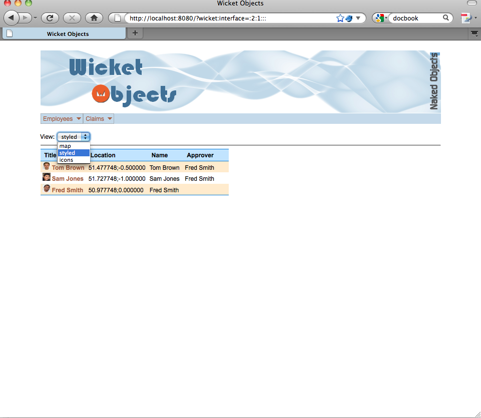
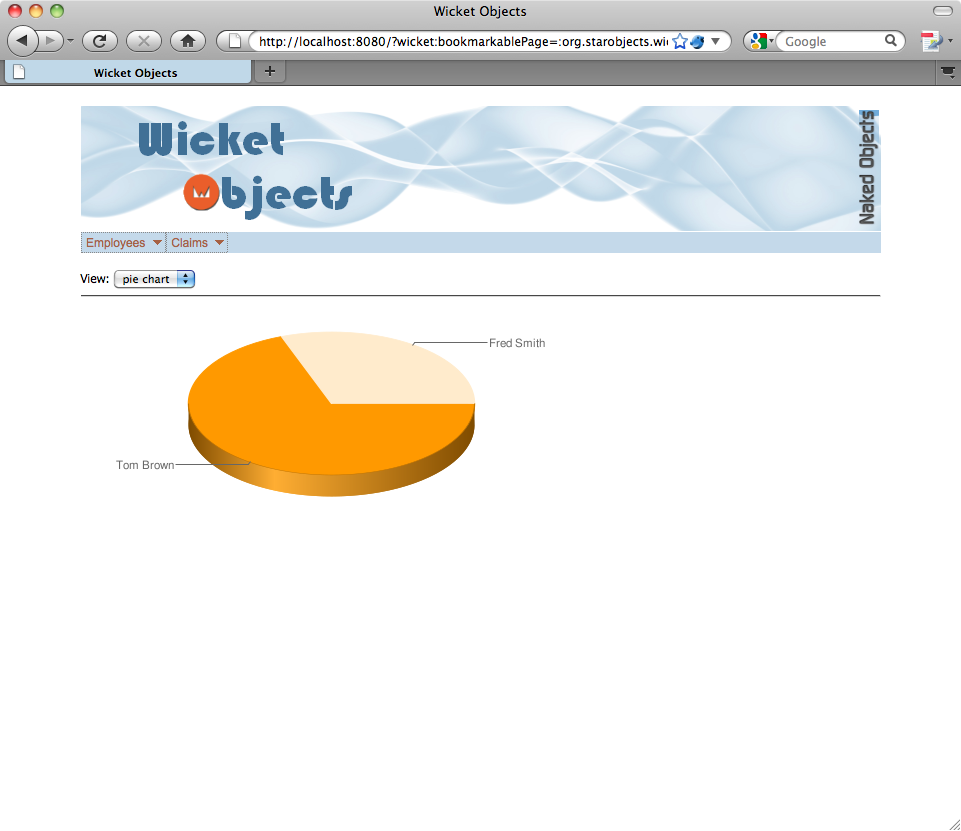
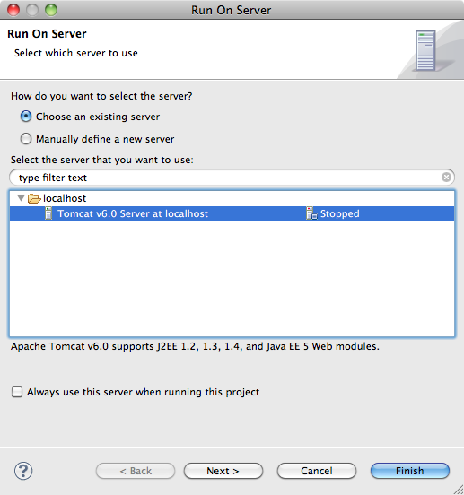
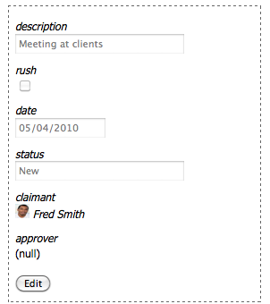

<!--
  Licensed to the Apache Software Foundation (ASF) under one
  or more contributor license agreements.  See the NOTICE file
  distributed with this work for additional information
  regarding copyright ownership.  The ASF licenses this file
  to you under the Apache License, Version 2.0 (the
  "License"); you may not use this file except in compliance
  with the License.  You may obtain a copy of the License at

        http://www.apache.org/licenses/LICENSE-2.0

  Unless required by applicable law or agreed to in writing,
  software distributed under the License is distributed on an
  "AS IS" BASIS, WITHOUT WARRANTIES OR CONDITIONS OF ANY
  KIND, either express or implied.  See the License for the
  specific language governing permissions and limitations
  under the License.
-->
Preface
=======

The *Apache Isis Wicket Viewer* provides a customizable web-based viewer
for *Apache Isis* implemented using the [Apache
Wicket](http://wicket.apache.org) framework. This user guide is written
for developers looking to write *Apache Isis* applications and deploy
them using the *Wicket Viewer*. It assumes familiarity with writing
*Isis* applications, but that is all that is needed to get an
application up-and-running with the generic OOUI.

Familiarity with *Apache Wicket* is useful to understand how the wicket
viewer fits together, but is essential unless you want to start
customizing the UI. If you're interested in learning more about *Wicket*
itself, then [Wicket In Action](http://www.manning.com/dashorst/)
(Martijn Dashort & Eelco Hillenius) is definitely worth reading.

Introduction
============

> This introductory chapter describes the objective of the *Wicket
> Viewer*, and the target audience for this guide.

Introducing the Apache Isis Wicket Viewer
-----------------------------------------

The *Wicket Viewer* provides a generic OOUI web-based viewer for *Apache
Isis* domain models, using [Apache Wicket](http://wicket.apache.org) as
the underlying web framework.

What this means for you, the developer, is that you can build a web
application solely by developing the domain model as pojos. The *Wicket
Viewer* will then render your domain objects in a web UI using ready
provided *Wicket* Components.

This generic UI provides a lot of functionality out-of-the-box:

-   Each domain entity is rendered as a form, with the appropriate
    individual component type for its values. This entity form also
    allows editable references to other objects, too.

-   Moreover, any collections of a domain entity (eg Order /
    OrderDetail) are also automatically rendered as a list, a table, or
    in any other appropriate representation. Both the scalar and
    collection references let the end-user easily "walk the graph"
    around your domain model.

-   Finally, the vuewer also renders actions (commands/behaviors) for
    your domain objects, and lets these actions to be invoked. This is
    what makes *Apache Isis*-based applications that much more than
    simple CRUD applications.

You can see examples of the UI in ?.

Over and above this generic interface, you are then free to customize
this interface in various ways. Your customizations can be general (eg
providing a way to render a collection of Locatable objects in a
google-maps mashup) or targetted (eg a particular way to render a
ShoppingCartWizard). Generally these customizations take the form of
bespoke *Wicket* Components, though simple customizations can be
performed just by modifying the CSS. Again you can see some examples of
these customizations in ?.

*Apache Isis* webapps that use the *Wicket Viewer* are bootstrapped in
the same as vanilla *Wicket* applications, with the *Wicket Viewer*
providing an implementation of *Wicket*'s `WebApplication` class that
additionally bootstraps the *Apache Isis* runtime. Authentication is
performed using *Apache Isis*' own security mechanism (which itself is
pluggable).

The Wicket Viewer compared to other Wicket RAD Frameworks
---------------------------------------------------------

### Differences in Capability

There are several frameworks that aim either to provide a back-end to
*Wicket* and/or that aim to eliminate some of the boilerplate; notable
examples are [Wicketopia](http://wicketopia.sourceforge.net), [Wicket
RAD](http://sites.google.com/site/wicketrad) and
[DataBinder](http://databinder.net/wicket/show/overview). There are also
precanned archetypes, such as jWeekEnd's
[LegUp](http://jweekend.co.uk/dev/LegUp) archetypes and
[IoLite](http://wicketstuff.org/confluence/display/STUFFWIKI/Wicket-Iolite),
that do some of the wiring for back-end technologies like
[Spring](http://springframework.org) and
[Hibernate](http://hibernate.org). So, how does *Wicket Viewer* for
*Apache Isis* compare to them?

Well, compared to *Wicketopia* for example, *Wicket Viewer* shares the
following ideas:

-   both frameworks support pluggable editors for Javabean properties

-   both frameworks allow the metamodel to be enhanced declaratively
    using annotations (eg @Length); these are picked up by the editors

-   both frameworks support (or aspire to support) the metamodel being
    built from various sources, including for example *Hibernate* or
    JSR-303 annotations etc. In the case of the *Wicket Viewer* this is
    done by using *Apache Isis*' own metamodel.

But there are some differences too; through *Wicket Viewer*'s use of the
*Apache Isis* it:

-   allows the metamodel to be enhanced imperatively as well as
    declaratively; naming conventions are used to associate supporting
    methods with the properties

-   supports user-defined value types (using *Apache Isis*' @Value
    annotation); important for domain-driven applications

-   supports three level of business rule (both declaratively and
    imperatively): is the entity class member visible, is it usable, is
    the value proposed valid. For most other frameworks, only the last
    of these (validation of proposed values) is typically supported

-   supports properties which are references to other entities, not just
    simple value types. In particular, the *Wicket Viewer*'s property
    editor for references allows instances to be found by invoking
    repositories in-situ

-   renders entity collections as well as entity properties

-   renders entity actions (commands), allowing more than simple CRUD
    behavior to be exposed. Indeed, it's possible for the domain entity
    to be immutable except through the invocation of actions

The flip side of the *Wicket Viewer*'s more extensive metamodel support
is that it uses *Apache Isis*' own metamodel API. In contrast,
*Wicketopia* (only supporting properties and not collections or actions)
can get by using java.bean.PropertyDescriptor from the JDK.

Compared to frameworks and archetypes that use *Hibernate* for the
backend, the *Wicket Viewer* (again by leveraging the rest of the
*Apache Isis* framework) is more general here too. So, it has a Session
concept that is analogous to a *Hibernate* session (and if using the
*JPA ObjectStore* as a backend, the *Apache Isis*' Session just wraps
the JPA provider's PersistenceContext *e*'s). But it also supports other
back-end persistence stores too. Indeed, *Apache Isis*' default to
support rapid development we usually use an in-memory object store.

The *Wicket Viewer* can also handle non-persisted objects as well as
persisted objects; with every managed object is stored in an identity
map. This support for non-persisted objects is important because it is
central to supporting specialized use cases, including managing
workflows for entering data, and dashboards for analyzing data.

A few other points worthy of mention:

-   The *Wicket Viewer* will automatically serialize both persisted and
    non-persisted objects, irrespective of whether the pojo itself is
    serializable. This is important if deploying on a cluster.

-   Through the *Apache Isis* core framework, every managed object also
    automatically has any domain service dependencies automatically
    injected into it),

-   Again, courtesy of *Apache Isis* core, every persisted object has a
    unique, immutable and serializable object Id (OID). This can be a
    very useful resource when integrating with external services such as
    REST and ESBs.

-   *Apache Isis* core also provides automatic dirty tracking, and
    optimistic locking.

Downsides? Currently *Apache Isis* does not support some of the
Enterprise Java APIs such as JTA, so interactions with domain services
that ultimately delegate to transaction stores (such as JMS) cannot be
enlisted in the same transaction as the persistence store. And,
obviously, it introduces a dependency on the *Apache Isis* framework
over and above technologies such as the JPA provider implementation.

### Differences in Philosophy

Aside from differences in capability, there's also a difference in
philosophy.

Frameworks such as *Wicketopia* make it easy to render a form to edit
the properties of an entity, but the application developer remains in
control of the rest of the application service layer, and in wiring the
various pages together.

With the *Wicket Viewer*, though, it is the framework that is in control
of this layer too, because the links between pages are ultimately
rendered by the property editor Components provided by the viewer, and -
in rendering the links representing references - controls . What that
also means is that every page rendered by the *Wicket Viewer* is always
of either an object (typical case), or an action parameter dialog, or of
a collection (the result of invoking an action).

Within this constraint, there is a lot of flexibility, though, because
every element of the page can be customized. Internally the *Wicket
Viewer* uses the chain of responsibility pattern to determine how which
Component type to use to render a page element. This works at a
fine-grained level (eg a date editor) and also at a larger-scale, (eg
rendering a collection of Locatable entities on a google maps). See ?
for more on this.

### Part of the *Apache Isis* framework

The *Wicket Viewer* is only one of a number of viewers available for
*Apache Isis*. What that means is that you can take your same domain
objects model and deploy them in other architectures. For example, the
DnD viewer is a rich, desktop GUI that employs a drag-n-drop metaphor
(hence its name). It can be run as a standalone single-user application
or in client/server mode. Even if you don't deploy this viewer in
production, the way that it displays domain objects makes for a very
good development tool: something akin to a UML design tool, only
animated.

*Apache Isis* also supports a number of different ways to test your
application. Domain objects written to the *Apache Isis* programming
model are just pojos, and so can easily be unit tested using frameworks
such as [JUnit](http://junit.org) and [JMock](http://jmock.org). As a
step up from that, *Apache Isis* provides its own integrations with
JUnit, providing a "headless" programming model that wraps your domain
objects in proxies. This allows unit testing as if through the lens of a
GUI; trying to invoke an action that is disabled will throw an
exception.

Moving up to story testing/BDD, *Apache Isis* integrates with
[Concordion](http://concordion.org). The business analyst specifies the
behavior of the system in HTML, and then the developer wire up this
specification to the domain model using a set of fixtures that interact
with the domain objects following the same rules as the viewers. This
allows application-level testing without the hassle of using a GUI
testing framework such as *Selenium*.

One final point: *Apache Isis* has a strong separation between its
programming model and the framework that understands that programming
model. So, your domain objects depend only on the *Apache Isis* applib
(which defines annotations such as @RegEx), not the framework itself.
This allows you to take your domain objects and deploy them on other
frameworks later, if need be. The *Wicket Viewer* maintains this strong
separation, defining its own applib for annotations and features unique
to the *Wicket Viewer*.

The *Wicket Viewer* compared to other *Apache Isis* viewers
-----------------------------------------------------------

Because the *Wicket Viewer* renders your domain model within a webapp,
it is to some extent similar to the HTML viewer that is provided
out-of-the-box by *Apache Isis* itself. However, unlike the HTML viewer,
the *Wicket Viewer* is highly customizable. The *Wicket Viewer* itself
essentially consists of a set of [Wicket](http://wicket.apache.org)
Components that are used to render domain objects, individual member
elements of domain objects, and indeed collections of domain objects.
The components provided are sufficient to render any *Apache Isis*
domain model. However, any developer with experience of *Wicket* can
easily write their own components and register them with the *Wicket
Viewer*. In this way, custom renderings of domain objects can be
achieved.

Typical Flow for Developing a Wicket Objects Application
--------------------------------------------------------

There are, of course, lots of ways to skin any given cat, but here's how
you might go about developing an *Apache Isis* application to be
deployed using the *Wicket Viewer*:

-   use the *Apache Isis* application archetype to create an outline
    domain model, running against the in-memory object store. The
    structure of a *Apache Isis* application is reviewed in ?.

-   (optionally) use the DnD viewer to define some of the basic domain
    services and entities. Or, you might want to skip this step and
    develop solely using Wicket.

-   run your application under *Wicket*, either using a built-in Jetty
    web server (see ?) or as a regular webapp (see ?).

-   customize the look-n-feel to use your preferred fonts and logos by
    updating the CSS (see ?). You can also use CSS to fine-tune the
    layout for selected objects or object members (see ?).

-   continue to develop your domain application, identifying properties,
    collections and defining behavior through actions. Also, define
    fixtures to represent pre-canned scenarios to explore with your
    domain expert. Check out the core *Apache Isis* documentation for
    more on developing domain objects.

-   fine tune the set of Components used to render your entities. The
    *Wicket Viewer* provides built-in Components to render every element
    of your domain objects, and in some cases provides more than one
    Component. When the *Wicket Viewer* provides a number of alternate
    views like this, you might prefer only one. Or, you might use an
    existing Component and adapt it into your own Component. In either
    case, you'll need to fine-tune the set of ComponentFactorys (see ?).

-   implement custom representations of some entities (or collections of
    entities), where it makes sense. For example, you might want to
    display objects that have a location in a google maps mashup, or
    objects that have a date/time in a calendar. Ultimately these custom
    representations are also just ComponentFactorys. A number of
    Components (including one for google maps and one for charting) are
    described in ?; use these directly or use them as inspiration for
    your own.

-   support specialized use cases, if you have any. That is, rather than
    require the end-user to interact directly with persisted entities,
    introduce transient process objects to manage workflow and bulk
    input, or write transient report objects to provide dashboards

-   as you continue to develop your application, you may need to
    integrate with external services. For example, you might want to
    send out an email, or invoke a web service exposed by some other
    system in your enterprise. Define an interface for these domain
    services, and register their implementation in the *Apache Isis*
    configuration file. See the main *Apache Isis* documentation for
    more details on this.

-   ultimately your application will be ready to deploy. Before you do,
    though, remember that you'll need to sort out persistence and
    security (see ?)

Enough verbiage. The next chapter is a run through of a simple
application, screenshot by screenshot, so you can quickly assess whether
the *Wicket Viewer* fits your needs.

Application Walkthrough
=======================

> This chapter is a collection of screenshots to give you an idea of
> what the
> Wicket Viewer
> can do.

Most of the screenshots in this chapter require no specific GUI code; in
fact the first six sections require no specialized code other than the
domain objects. The GUI that you see is generated by the *Wicket Viewer*
at runtime, directly from the domain model. You can find all the code
for the domain objects in ?.

Logging on, and the Application Services Menu
---------------------------------------------

The *Wicket Viewer* integrates with *Apache Isis* authentication
mechanism (which is itself pluggable); so we start off with a login
screen:

The initial home page shows a welcome message and more importantly a
menu bar for each of the registered services defined in the domain
application. These application services are the start points for the
user, allowing them to find existing objects and to create new ones. For
example the `Employees` menu item corresponds to the EmployeeRepository
class.

From the menu bar we can get to the menu items for each service. So, for
example, the `Employees` domain service provides two actions,
`All Employees` and `Find
      Employees`. These are generated automatically from corresponding
methods - allEmployees() and findEmployees() - in the EmployeeRepository
service.

Viewing Entities and Collections of Entities
--------------------------------------------

Because the `All Employees` action takes no arguments, invoking it just
returns its results. In this case the action returns a collection (of
Employees), and so the viewer renders the collection as a table. If the
action had returned a single object, then that would have been rendered
instead.

Clicking on one of the links takes us to a page rendering that object,
in this case an Employee. There is a form for the entity's properties on
the left, and summary details on the right. In this particular case the
entity has no collections; we'll see one that does shortly.

In the summary section we an image, a title and the entity actions. All
these are rendered directly from a metamodel built by inspecting the
entity's class. Just as we can invoke actions on the services, we can
also invoke actions on the entities; for example, to view this
Employee's Claims with the `Claims For,,,` action.

As before, this action returns a collection (of Claims) and so is
rendered as a table.

Clicking on a link to a Claim again renders the entity. This is rendered
in a similar manner to the Employee entity seen earlier. However, the
Claim entity also has a collection (of ClaimItems), so these are also
rendered.

Editing Objects
---------------

In *Apache Isis* applications, we modify objects either by invoking
actions on them or by editing them directly. Which properties are
editable is determined by the entity itself, with the *Wicket Viewer*
providing an appropriate editor for each property type. In the following
screenshot we see the Claim entity being edited.

As well as supporting the editing of properties with value types
(boolean, String, Date etc), the viewer also allows properties
representing references to other entities to be edited. For example,
each Claim has an `approver` (of type Approver, and implemented by
Employee). Thus, the viewer gives us the ability to find an Employee
from the `Employees` repository:

Leaving us with the `approver` reference set up:

Invoking Actions
----------------

Being able to edit entities makes it easy to build CRUD-style
(create/read/update/delete) applications. The *Wicket Viewer* also
allows arbitrary actions to be performed on entities. In the screenshot
below, we see the `Add Item` action (corresponding to addItem() method
on the Claim class) being called:

Because this action takes parameters, the viewer renders a dialog form
for the user to complete. Just as with the entity editor, we can specify
parameters of any type, including references to other entities if we
wish). In this particular case the parameter types are just numbers and
strings:

When the action is complete, the entity is modified, by adding a new
ClaimItem into the Claim's `items` collection.

Admittedly, this `Add Item` action just a CRUD-style action. But the
business logic in the action could be arbitrarily complex. The other
action in Claim is `Submit`, which could perform lots of business
processing:

This action also takes an argument, being a reference to an Approver:

When the action is performed, the object's state is updated, along with
any other processing. For example, a message could have been sent via an
enterprise service bus to the processing department. Note the title of
the Claim entity has also been updated:

Business Rules
--------------

In addition to actions, we can also capture business rules by means of
validation. For example, a Claim, once submitted, cannot be submitted
again. With the *Wicket Viewer*, this is shown by a tooltip:

*Apache Isis* supports three different types of validation: whether the
class member (property, collection or action) is visible; whether it is
usable, and, whether the proposed value or arguments are valid. Or, more
pithily, "can you see it, can you use it, can you do it". The viewer
surfaces all of these different validation rules in the GUI.

View Components
---------------

The pages rendered by the *Wicket Viewer* are built from multiple
*Apache Wicket* Components. For example, the application service menu
bar has its own Component:

Likewise, there's a Component to render an entire entity:

And there's a Component to display the properties of an entity:

And in turn there's a Component for every entity property:

There are Components such as these for every class member, including
collections, actions and, indeed, action parameters. In fact, you can
think of the *Wicket Viewer* as basically a collection of pre-canned
Components that know how to render the *Apache Isis* metamodel.

Note, by the way, the CSS classes. Each HTML element can be targetted
either by its type (a string scalar), or by its class member (the
Claim's `description` property), or both. The viewer therefore makes it
easy to contribute custom CSS that applies to every page.

Alternate Views
---------------

As we've seen already, there's a Component to render an entire entity.
In fact, it's possible to provide more than one Component to do this. We
could also view the entity in a tabbed view:

When there is more than one Component capable of rendering the object,
the viewer allows the view to be selected:

This works for collections too; using the selector we can view a
collection of Employees in a variety of ways:

Selecting the `icons` view shows the collection of Employees as icons:

So far all the screenshots we've seen have been generated from a basic
domain application, with no custom GUI coding (see ?). But the *Wicket
Viewer* is also extensible. So, we can write custom views/components,
provide a corresponding ComponentFactory and then plug them into the
*Wicket Viewer*'s registry of ComponentFactorys. For example, if we make
Employee implement a view-specific Locatable interface, then we can
render them on a google-maps mashup:

The selector, by the way, is actually implemented as yet another
view/component, capable of rendering the entity or collection. It
queries the ComponentFactory registry to determine how many other
ComponentFactorys there are capable of rendering the entity or
collection; if more than one then it provides a drop-down and then
delegates to the other Components to do the work.

Specialized Use Cases
---------------------

Being able to easily render entities and collection of entities without
any custom UI coding is great for being able to develop an understanding
of the problem domain. However, it doesn't always make sense to let the
user interact directly with the domain objects. For example, if the
domain objects are very fine-grained such that clicking into them would
be tedious for the user to do, it makes sense to introduce another
object that collect the required data and walk the graph of domain
objects on the users behalf. Or, more straight forwardly, the use case
might be particularly complex or subtle, and we want to provide the user
with additional guidance.

The *Wicket Viewer* therefore lets us work with objects designed to
guide the user through the use case. Because they represent a particular
solution to help the user achieve their objective, you can think of them
as being part of the solution space (whereas regular domain objects
belong to the problem space). Another name also given for objects of
this type is "process objects"; they take the user through a particular
process.

For example, we might have a wizard that takes the user through the
process of making a new Claim:

The object this action returns is not a Claim, instead it is a
ClaimWizard. Unlike Claim, this is not persisted; its state is bound to
a particular users' session. The design of the ClaimWizard is like any
other wizard, taking the user through a number of pages; first an
introductory page:

After that we are taken through pages for each of the properties; For
example the next page prompts for the Claim's `claimant`:

The Claim's `approver` and `description` properties likewise have the
own pages, for example:

The final page allows the user to review details, then confirm:

On finish, the ClaimWizard will create and persists the Claim.

Process objects like wizards are primarily concerned with inputting
data. We can also have objects that are tailored towards the output of
data, eg for reporting. For example, we could have a (non-persisted)
ClaimSummary object that sums up Claim amounts by Claimant:

We can then combine this with custom views, eg to represent a collection
of such ClaimExpenseSummarys as a pie chart:

There's some guidance on writing application code to deal with such
specialized use cases in ?.

Running the Application
=======================

> This chapter describes how to take an *Apache Isis* application and
> get it running using the *Wicket Viewer*, with the non-customized,
> generic OOUI.

Applications deployed to run with the *Wicket Viewer* are, ultimately
just *Wicket* webapps that happen to boot up *Apache Isis*. As such,
they are bootstrapped with a `web.xml` that is structured the same as
any other *Wicket* application.

This chapter describes how to run up such a webapp starting with a
regular *Apache Isis* application.

Structure of an Apache Isis Application
---------------------------------------

We recommend that you use *Apache Isis*' Maven application archetype to
set up your application. Doing so will result in a multi-module project
that contains the following modules:

-   `app`

    Main (parent) module, whose `pom.xml` references the submodules

-   `app/dom`

    Domain object model, plus interfaces for services, repositories and
    factories

-   app/domsvc

    Implementation of domain services (not repositories/factories)

-   `app/objectstore-default`

    Implementation of repositories/factories for the default object
    store

-   `app/fixture`

    Fixtures, used to seed (in-memory) object store when running in
    exploration/prototype mode

-   `app/commandline`

    Bootstrap for running from the command line (typically, the DnD
    viewer or HTML viewer)

-   `app/viewer-wicket`

    The application set up to be run using wicket, and packaged up as a
    webapp.

You will see that the archetypes creates a number of other
`app/viewer-xxx` and `app/objectstore-xxx` modules. You can delete those
modules that aren't relevant to your final deployment (probably the
`app/viewer-xxx` modules and most of the `app/objectstore-xxx` modules,
or you can just ignore them. If you do delete any modules, remember to
remove their reference from the parent `app/pom.xml` file'a \<modules\>
section).

### The viewer-wicket module's web.xml

The `viewer-wicket` module aready contains a `web.xml` file to define
the web app, in the `src/main/webapp` directory. The contents of this is
largely boilerplate, and will be very familiar if you already know the
*Apache Wicket* framework:

    <?xml version="1.0" encoding="ISO-8859-1"?>
    <web-app xmlns="http://java.sun.com/xml/ns/j2ee" xmlns:xsi="http://www.w3.org/2001/XMLSchema-instance"
     xsi:schemaLocation="http://java.sun.com/xml/ns/j2ee http://java.sun.com/xml/ns/j2ee/web-app_2_4.xsd"
     version="2.4">

      <display-name>claims</display-name>
      <filter>
        <filter-name>wicket.app</filter-name>
        <filter-class>org.apache.wicket.protocol.http.WicketFilter</filter-class>
        <init-param>
          <param-name>applicationClassName</param-name>
          <param-value>org.apache.isis.viewer.wicket.viewer.IsisWicketApplication</param-value>
        </init-param>
      </filter>

      <filter-mapping>
        <filter-name>wicket.app</filter-name>
        <url-pattern>/*</url-pattern>
      </filter-mapping>

    </web-app>

The IsisWicketApplication is a subclass of *Wicket*'s own WebApplication
that bootstraps *Apache Isis*, handles authentication and sets up
sessions and transactions.

### Deployment Mode

*Apache Wicket* webapps can be run in one of two "configuration type"s,
either in the `development` configuration type or in the `deployment`
configuration type. In Wicket, the configuration type can be specified
as either:

1.  A system property: `-D
                wicket.configuration`

2.  as a servlet specific `<init-param>`

3.  as a context specific `<context-param>`

Setting this value changes various properties, such as whether templates
are reloaded. Wicket's Application\#configure() method is the place to
look for all the differences.

For its part, *Apache Isis* defines various "deployment mode"s. For
example, `exploration` and `prototype` mode are both intended for
single-user development, with the former requiring no login and also
including any actions annotated as `@Exploration`. For multi-user
(production) use, *Apache Isis* provides the `server` deployment mode,
associating a separate *Apache Isis* runtime (IsisContext) to each
thread (ie bound to a `ThreadLocal`).

The *Wicket Viewer* maps *Wicket*'s `development` configuration type to
*Apache Isis*' `prototype` deployment mode. However, the `server`
deployment mode provided by *Apache Isis* is not quite appropriate for a
*Wicket* webapp, because there could be multiple concurrent requests for
a given user (originating from the same browser/user agent). The *Wicket
Viewer* therefore defines a custom deployment mode which binds the
*Apache Isis* runtime to the *Wicket* session (see the
IsisContextForWicket class if you're interested in such things).

What all this means is that selecting between *Apache Isis* deployment
modes is done just by specifying the *Apache Wicket* configuration type.
If you're already familiar with Wicket there's therefore nothing new to
learn: just configure the webapp to run in either `development` or
`deployment` mode.

### Security

Since both of the deployment modes supported by *Wicket Objects* require
a login, it means we need to set up security. The IsisWicketApplication
class provided by the *Wicket Viewer* subclasses from *Wicket*'s own
AuthenticatedWebApplication, and serves up a sign-in page. To ensure
that this sign-in page appears, every web page served up by the *Wicket
Viewer* is annotated with
`@AuthorizeInstantiation("org.apache.isis.viewer.wicket.roles.USER")`,
which requires that every login has a role called
`org.apache.isis.viewer.wicket.roles.USER`.

*Apache Isis* deployment modes provide a couple of ways of avoiding
login during development. For example, in `exploration` mode the viewers
automatically login, while in `exploration` mode and `prototype` mode
specifying a `LogonFixture` will means an automatic logon using the
details provided within that fixture. The *Wicket Viewer* does not
support `exploration` mode, however, and does not currently support
LogonFixture. What that means is that it's always necessary to login.

The *Wicket Viewer* delegates to *Apache Isis* to authentication.
*Apache Isis*' default authentication mechanism is a no-op and requires
no configuration. If you decide to a different authentication mechanism
(eg file-based security, org.apache.isis.alternatives.security:file, or
LDAP-based security, org.apache.isis.alternatives.security:ldap) then
refer to the appropriate documentation for that module.

The *Wicket Viewer* simply always places each login into the
`org.apache.isis.viewer.wicket.roles.USER` role, to ensure that once the
sign-in page is navigated past, that the user can access each web page.

One consequence of this design is that the roles cannot currently be
used by the *Apache Isis* domain objects nor the authorization
mechanism; every user is simply in the USER role. This will be addressed
in the future.

Running as a WAR
----------------

The most straightforward approach for running a *Wicket
Viewer*application is to build a WAR archive from the `viewer-wicket`
module. Most IDEs will then allow this WAR to be deployed on an external
servlet container, for debugging. For example, in Eclipse this is done
by Run As \> Server:

and then select the external servlet container to deploy against:

If deploying this way, then the web browser URL may be slightly
different. For example with Eclipse the URL to specify is
<http://localhost:8080/webappname>.

Running using *Isis*' WebServer class
-------------------------------------

As an alternative to deploying as a webapp, you can use Isis' WebServer
class. This class has its own main() to bootstraps Jetty and configures
a webapp from the `web.xml` file. If using Eclipse, for example, then yo
can create a `.launch` configuration to run your application using
WebServer.

### Adding Dependency to Bootstrap

The only thing you need to do is to edit the `viewer-wicket` module's
`pom.xml`; add/comment in:

    <dependency>
     <groupId>org.apache.isis.core</groupId>
     <artifactId>webserver</artifactId>
    </dependency>

### Running the Application

Running the application is just a matter of running the
org.apache.isis.WebServer. For example, in Eclipse the following launch
configuration should suffice:

Running this will boot strap a Jetty webserver:

You can then log on using <http://localhost:8080>:

Customizing the Startup
-----------------------

Most of the remaining chapters address various means by which the UI
generated by the *Wicket Viewer* can be customized. Before we go any
further, though, we should mention that the viewer uses dependency
injection provided by [Guice](http://google-guice.googlecode.com). It
comes with default bindings, so customizing the *Wicket Viewer* requires
overriding these default bindings.

Note: this usage of Guice is likely to be replaced by JSR-299 based
dependency mechanism.

Specifically, in IsisWicketApplication, there's a method
newIsisWicketModule():

    public class IsisWicketApplication extends AuthenticatedWebApplication {
      ...
      protected Module newIsisWicketModule() {
        return new IsisWicketModule();
      }
    }

This method can be overridden in your own subclass of
IsisWicketApplication, providing a new implementation of *Guice*'s
Module interface. Typically you'll just want to override one or two of
the bindings, so you should use the Modules helper class:

    public class MyApplication extends IsisWicketApplication {
      ...
      protected Module newIsisWicketModule() {
        return Modules.override(super.newIsisWicketModule()).with(
          new AbstractModule() {
            @Override
            protected void configure() {
              // override bindings here
            }
          }
        );
      }
    }

To pick up your subclass of IsisWicketApplication, just update the
`web.xml` file.

Customizing CSS
===============

> This chapter describes how to customize the UI generated by the
> *Wicket Viewer* by providing application-specific CSS.

CSS is used heavily by the *Wicket Viewer*, with the HTML of each
Component using CSS classes for the styling. But you can override the
default styling by supplying an application-level CSS file.

By default this file should be called `application.css` and should
reside within `WEB-INF` directory.

There are two levels at which we can override the default styling,
either generically or specific to a particular domain. Let's look at
both.

Generic CSS
-----------

The name of each class indicates the nature of what is being rendered,
and each Component provides some default styling so that the
out-of-the-box UI is usable. For example, an entity icon, title and
actions are rendered as:

The icon and title for this are rendered as:

    

      
      <label class="entityTitle" wicket:id="entityTitle">Fred Smith</label>
      ...
    

So, to change the font, you could use:

    div.entitySummary > label.entityTitle {
      color: maroon;
      font-size: xx-large;
      font-weight: bolder;
    }

This would render the entity icon and title as:

In this way you can develop a look-n-feel for the application (or
perhaps your organization).

Specific CSS
------------

As well as targetting HTML elements generically, individual class
members can also be targetted for a particular domain model.

For example, the properties of a Claim object might be rendered as:

The HTML for the description property is:

    

      <wicket:panel>
        

          <label wicket:id="scalarIfRegular" for="scalarValue3d">
            description
            
              <input type="text" title="" size="25" disabled="disabled"
                 value="Meeting at clients" wicket:id="scalarValue"
                 id="scalarValue3d"
                 name="properties:1:scalar:scalarIfRegular:scalarValue">
            
          </label>
          
            <wicket:panel>
            </wicket:panel>
          
        

      </wicket:panel>
    

To change the label of this specific element, we could use:

    .Claim-description .scalarName {
      color: maroon;
      font-weight: bolder;
    }

which would give us:

This is a slightly trite example, but demonstrates the point.

Changing the location/name of the application CSS file
------------------------------------------------------

As already mentioned, the default for the application CSS file is in
`WEB-INF/application.css`. If for any reason you want to change this,
you can do so by subclassing IsisWicketApplication and overriding the
newIsisWicketModule() method.

For example, to use `css/myapp.css` (under `WEB-INF`) you would write:

    public class MyApplication extends IsisWicketApplication {
      ...
      protected Module newIsisWicketModule() {
        return Modules.override(super.newIsisWicketModule()).with(
          new AbstractModule() {
            @Override
            protected void configure() {
              bindConstant().annotatedWith(ApplicationCssUrl.class).to("css/myapp.css");
            }
          }
        );
      }
    }

Your custom application should then be registered in `web.xml`, as
described in ?.

Using the Wicket Viewer AppLib
==============================

> This chapter explains how to use certain viewer-specific features in
> your domain application.

Many *Isis* components have their own application library, the *Wicket
Viewer* included. This allows you to specify additional viewer-specific
semantics within your domain model; the viewer can then render them
appropriately.

Configuring the Project Modules
-------------------------------

In order to use the viewer-specific features, the `dom` module must
reference the applib, and the `viewer-wicket` module must be configured
appropriately.

### Referencing the AppLib

In the dom project, add in a `<dependency>` to the *Wicket Viewer*
applib:

    <dependencies>
      ...

      <!-- Wicket Viewer -->
      <dependency>
        <groupId>org.apache.isis.viewer.wicket</groupId>
        <artifactId>applib</artifactId>
      </dependency>

      ...
    </dependencies>

This will allow you to use the *Wicket Viewer*'s annotations etc. in
your domain objects.

### Configuring the *Wicket Viewer* Facets

In addition, you must also configure your application so that the *Isis*
metamodel contains the information to be picked up by the *Wicket
Viewer*.

In the `viewer-wicket` module, add the following to `isis.properties`:

    isis.reflector.facets.include=\
        org.apache.isis.viewer.wicket.metamodel.wizardpagedesc.WizardPageDescriptionAnnotationFacetFactory\
       ,org.apache.isis.viewer.wicket.metamodel.cssclass.CssClassAnnotationFacetFactory

This basically instructs *Apache Isis* to capture additional information
(facets) in its metamodel. Now let's look at what these facets are used
for.

@CssClass
---------

The @CssClass annotation allows you to specify an additional CSS class
(or classes) applied on any object type, property, collection or action.
This CSS will be added verbatim to any CSS classes that are normally
applied by the *Wicket Viewer* itself.

\*\*\* TODO: complete.

There is further discussion on

@WizardPageDescription
----------------------

It's common for wizards to have a description explaining what the user
is expected to do. This can be modeled as a String property annotated
with @WizardPageDescription, for example:

    @NotPersistable
    public class ClaimWizard extends AbstractDomainObject {

        ...

        @WizardPageDescription
        @MemberOrder(sequence = "1")
        public String getPageDescription() { ... }

        ...
    }

Adding this annotation causes the *Wicket Viewer* to select a different
Component to be used to render this property; specifically, one that
renders the value as a large label. You can see the result of this
annotation in below (the label above the claimant).

Note that this annotation only affects the description; the three
buttons shown in the above screenshot are as a result of the wizard
being implemented as a custom component. For more on that topic, see ?.

Customizing the Component Set
=============================

> This chapter describes the how to customize the UI by modifying the
> set of components used to render objects, properties, collections or
> actions.

The *Wicket Viewer* offers several ways in which the UI rendered can be
customized, from simply tweaking the CSS (see ?) through to the use of
custom components for mashups and wizards. This chapter explains how to
use pre-existing custom components; ? explains how to write your own
components, and lists some components that have already been developed.

There are more details provided in each of the sections that follow.

Component Factories
-------------------

### ComponentFactory interface

At its heart the *Wicket Viewer* consists of a set of *Wicket*
`Component`s and corresponding IModel\<?\>s that are used to render
entities, collections of elements and indeed individual members of
elements. Each Components is created by a corresponding
ComponentFactory, with the factory to use discovered using a
chain-of-responsibility pattern.

The Components created by the *Wicket Viewer* vary in size from
rendering an entire collection of entities all the way down to a single
property of an entity. You can find the full set of built-in Components
by searching for implementations of ComponentFactory:

For example, the CollectionContentsAsAjaxTableFactory class is used to
render a collection of entities (eg returned from an action invocation)
as, erm, an ajax table;

    public class CollectionContentsAsAjaxTableFactory extends ComponentFactoryAbstract {
      private static final long serialVersionUID = 1L;
      private static final String NAME = "styled";

      public CollectionContentsAsAjaxTableFactory() {
        super(ComponentType.COLLECTION_OF_ENTITIES, NAME);
      }

      @Override
      public boolean appliesTo(IModel<?> model) {
        return model instanceof EntityCollectionModel;
      }

      public Component createComponent(String id, IModel<?> model) {
        EntityCollectionModel collectionModel = (EntityCollectionModel) model;
        return new CollectionContentsAsAjaxTable(id, collectionModel);
      }
    }

The selection of the ComponentFactory is based on two criteria: the
ComponentType, and the IModel\<?\>. Broadly speaking the ComponentType
standardizes the `wicket:id` used in the HTML fragment (so
`
` would map onto the
ComponentType.COLLECTION\_CONTENTS, while the IModel\<?\> is the
corresponding information used for the rendering of that component. But
there's a semi-formal relationship between these two concepts; the
ComponentType effectively acting as a power-type for the subclass of
IModel\<?\> that is supplied.

The superclass ComponentFactoryAbstract takes responsibility for
checking that the ComponentType matches the `wicket:id`, while
delegating the checking of the IModel to its subtype:

    public abstract class ComponentFactoryAbstract implements ComponentFactory ... {
      ...
      public final boolean appliesTo(ComponentType componentType, IModel<?> model) {
        return componentType == getComponentType() && appliesTo(model);
      }

      protected abstract boolean appliesTo(IModel<?> model);
      ...
    }

The subclass then refines this check by overriding appliesTo() to also
check the model; returning true indicates that the ComponentFactory is
able to render that model, after which the createComponent() method is
then called to actually create the instance. So in
CollectionContentsAsAjaxTableFactory, its implementation simply checks
if the supplied model is an EntityCollectionModel. More
sophisticated/less generic ComponentFactory might also make additional
checks; you can find some examples of these in ?.

### Registering ComponentFactorys using META-INF Services

The easiest way to register new ComponentFactorys is using the JDK's own
ServiceLoader capability.

All that is needed is for your ComponentFactory to be registered in a
file on the classpath call
`META-INF/services/org.apache.isis.viewer.wicket.ui.ComponentFactory`.
The contents of this file should be the fully qualified class name of
your ComponentFactory implementation. And that's it! Registering the
ComponentFactory is done automatically just by virtue of updating the
classpath. You'll find that the custom components described in ? all use
this technique.

Note that this technique does not allow you to remove existing
ComponentFactorys, only add new ones. So if you do want to exclude any
of the built-in ComponentFactorys, then you will still need to use the
ComponentFactoryList method.

> **Note**
>
> This capability is provided by the ComponentFactoryRegistry component,
> which is also bound in the IsisWicketModule. If you wanted to, you
> could replace this higher-level registry component with your own
> implementation. There's probably very little need to do this though,
> given that you can just as easily customize using ComponentFactoryList
> or `META-INF` services.

### Registering ComponentFactorys using a custom ComponentFactoryList

The set of ComponentFactorys that are provided with the *Wicket Viewer*
are specified by the ComponentFactoryList interface.

If you only want to add new factories, we recommend using the technique
described in ?. But if you want to remove support for any of the default
factories, or perhaps change the order in which factories are
registered, you'll need to do use write and the bind in your own
implementation of ComponentFactoryList.

To write your implementation of ComponentFactoryList, start with the
default implementation, ComponentFactoryListDefault. You'll see that it
is written so that it can be easily subclassed and overridden on an
as-needed basis. Worst case scenario, you can copy-and-paste code as
necessary.

Then, you need to override the binding in newIsisWicketModule(), eg:

    public class MyApplication extends IsisWicketApplication {
      ...
      protected Module newIsisWicketModule() {
        return Modules.override(super.newIsisWicketModule()).with(
          new AbstractModule() {
            @Override
            protected void configure() {
              bind(ComponentFactoryList.class).to(MyComponentFactoryList.class);
            }
          }
        );
      }
    }

You should also ensure that your MyComponentFactoryList is annotated
with @Singleton.

And, do remember to update `web.xml` to reference your subclass of
IsisWicketApplication.

Advanced Customization
----------------------

This section covers a couple of more advanced customization topics.

### Page Registry

While the content of any given web page rendered by the *Wicket Viewer*
is made up of multiple Components, there are in fact only a small number
of WebPages:

-   WelcomePage displays the initial home page with a welcome message

-   EntityPage displays a single entity

-   ActionPage displays an action dialog or the results of invoking an
    action.

Each of these has a corresponding HTML page which defines the content of
that page. In many cases the look-n-feel of these pages can be adjusted
simply using CSS, as described in ?. If necessary though an entirely
different page layout can be specified, for example to put the menubar
on the left rather than at the top.

The easiest approach to define a new page is to subclass PageAbstract
superclass and then provide a different implementation of PageRegistry.
As for ComponentFactorys, this is done by providing a new
implementation, and then overriding a binding in newIsisWicketModule().

The default pages are specified by PageClassListDefault:

    public class PageClassListDefault implements PageClassList  {

      @Override
      pulic void registerPages(PageRegistrySpi pageRegistry) {
        pageRegistry.registerPage(PageType.SIGN_IN, WicketSignInPage.class);
        pageRegistry.registerPage(PageType.SIGN_OUT, WicketSignOutPage.class);
        pageRegistry.registerPage(PageType.ENTITY, EntityPage.class);
        pageRegistry.registerPage(PageType.HOME, HomePage.class);
        pageRegistry.registerPage(PageType.ACTION, ActionPage.class);
      }
    }

You can easily copy-n-paste this to create your own implementation. Note
though that there must be a registered page for every PageType instance,
otherwise the *Wicket Viewer* will fail fast on boot time.

Overriding the binding is done in the usual way:

    public class MyApplication extends IsisWicketApplication {
      ...
      protected Module newIsisWicketModule() {
        return Modules.override(super.newIsisWicketModule()).with(
          new AbstractModule() {
            @Override
            protected void configure() {
              bind(PageClassList.class).to(MyPageClassList.class);
            }
          }
        );
      }
    }

Don't forget to update the web.xml to specify your subclass of
IsisWicketApplication.

> **Note**
>
> If all you want is to provide a custom rendering of a particular
> interface or class, then you should instead write and register a
> ComponentFactory, with a ComponentType.ENTITY and filtering the
> EntityModel. The custom components described in ? do this, as does the
> component registered in the test application to render a wizard (see
> ?).

### Subclassing IsisWicketApplication

As we've seen, you can also customize *Wicket Objects* in various ways
by subclassing the IsisWicketApplication bootstrap. The most common
reason for doing so is to override the default implementation of
ComponentFactoryList.

This design follows the general style of *Wicket*; in fact, you'll see
that IsisWicketApplication itself overrides a number of other methods
(such as newRequestCycle() and newConverterLocator()), in order to hook
*Apache Isis* into the rest of Wicket.

In general it's unlikely that you'll need to alter the behavior of these
hook methods; but it's useful to know that *Wicket Objects* doesn't
particularly interfere with the way in which you may be used to
customizing regular *Wicket* applications.

Writing Custom Components
=========================

> This chapter provides some further guidance on objects designed to
> support specialized use cases.

Back in the application walkthrough (see ?) we saw that the *Wicket
Viewer* has support for non-persisted objects that are designed to
support specialized use cases. Whereas regular persisted domain objects
can be thought of as part of the problem space, such non-persisted
objects can be thought of as being part of the solution space because
they offer a particular solution to a particular user objective. We call
these objects *process objects* because objects they help a user perform
a particular process.

This chapter provides some general guidance on writing such process
objects, and outlines the support that exists in *Wicket Objects* for
writing custom components for such objects.

Custom Components for Process Objects
-------------------------------------

Because process objects are there to guide the user, they often go
hand-in-hand with custom components so that they can be rendered in a
particular way.

For example, in the application walkthrough we saw that a ClaimWizard
process object is rendered with its previous(), next() and finish()
actions as regular buttons:

Similarly, the ClaimExpenseSummary object (or rather, a collection of
them) hooks into the capabilities of the googlecharts component
(discussed in ?):

You can use any of the *Wicket Viewer*'s built-in Components that are
used to build the generic views for your own custom views; search down
the ComponentFactory inheritance hierarchy and there's a good chance
you'll find something of use. For example, you can easily add components
to represent properties in a wizard (the custom Component for
ClaimWizard does precisely this; you can inspect the code in ?).

The *Wicket Viewer* also has a small number of Components intended for
writing custom views.

### ProcessObjectPanelAbstract

The ProcessObjectPanelAbstract is intended to be used as the superclass
for any panel-like Component that will render a process object. Its
model is intended to be an EntityModel, which wraps the process object.

This adapter class contains a number of convenience methods to help
build panels:

-   addProperties(Form\<?\> form, String id)

    This adds the currently visible properties from the process object
    to the provided form

-   isValid(Form\<?\> form)

    This validates the process object, where the form holds the
    properties

-   executeNoArgAction(String actionId)

    Executes the indicated action on the process object (expected to
    take no-arguments).

Although minimal, these methods are sufficient to build a basic wizard.
The executeNoArgAction() method, for example, allows `Previous`, `Next`
and `Finish` buttons to be added.

### Help Wanted!

As you can see, the level of support provided by the *Wicket Viewer* for
custom views is, admittedly, quite limited. There's nothing to prevent
you from writing your own, of course, but to do so you'll need to use
with the *Apache Isis* metamodel APIs.

We hope to extend the components available as *Wicket Objects* continues
to be developed. But in the meantime, if you build a Component that you
think would be generally useful, please consider contributing it back to
this project for the benefit of others.

Use a Page enum for Wizards
---------------------------

Here's just a bit of good old-fashioned advice; consider using an enum
to track the state of your wizards.

For example, the ClaimWizard in the example app has the following enum
defined:

    @NotPersistable
    public class ClaimWizard extends AbstractDomainObject {

        public enum Page {
            INTRO("This wizard will take you through the process of creating a claim"),
            CLAIMANT("Enter the claimant that is making this claim"),
            APPROVER("By default, the claimant's own approver will approve this claim.  " +
              "Update here if another approver will approve this claim."),
            DESCRIPTION("Update the description if required."),
            SUMMARY("Confirm all details, or go back and amend if needed");

            private String description;
            private Page(String description) {
                this.description = description;
            }

            public String getDescription() {
                return description;
            }

            public boolean hasPrevious() {
                return ordinal() > 0;
            }
            public Page previous() {
                if (hasPrevious()) {
                    return values()[ordinal() - 1];
                } else {
                    return this;
                }
            }

            public boolean hasNext() {
                return ordinal() < values().length - 1;
            }
            public Page next() {
                if (hasNext()) {
                    return values()[ordinal() + 1];
                } else {
                    return this;
                }
            }

            @Ignore
            public boolean is(Page... pages) {
                for (Page page : pages) {
                    if (page == this) {
                        return true;
                    }
                }
                return false;
            }
        }

        ...
    }

This not only defines the descriptions of each Page, it also includes
some logic for the previous() and next() actions to delegate to:

    @NotPersistable
    public class ClaimWizard extends AbstractDomainObject {

        // {{ Page
        private Page page;
        @Hidden
        public Page getPage() { ... }
        public void setPage(final Page page) { ... }
        // }}

        // {{ Page Description
        @WizardPageDescription
        @MemberOrder(sequence = "1")
        public String getPageDescription() { ... }

        // {{ previous
        @MemberOrder(sequence = "1")
        public void previous() {
            setPage(getPage().previous());
        }
        public String disablePrevious() {
            return coalesce(noPreviousPage(), confirmIfOnSummaryPage());
        }
        private String noPreviousPage() {
            return !getPage().hasPrevious() ? "no previous page" : null;
        }
        // }}

        // {{ next
        @MemberOrder(sequence = "2")
        public void next() {
            setPage(getPage().next());
        }
        public String disableNext() {
            return coalesce(noNextPage(), confirmIfOnSummaryPage());
        }
        private String noNextPage() {
            return !getPage().hasNext() ? "no next page" : null;
        }
        // }}

        ...
    }

Custom Components in isis-contrib
=================================

> This chapter describes a number of custom components for the *Wicket
> Viewer*. Some of these integrate third party components and/or
> experimental.

As was described in ?, the *Wicket Viewer* is designed to be extensible,
allowing you to plug in more sophisticated renderings of the domain
objects that make up your application. This chapter describes a number
of custom components that demonstrate this capability, most of which are
basically wrappers around functionality within the *Wicket*'s companion
[WicketStuff](http://wicketstuff.org) project.

The components here are probably best considered as examples rather than
formally part of the *Wicket Viewer*, if only because we want the
*Wicket Viewer* to depend just on core *Wicket*, not *WicketStuff*. But
what you will find is that all the components here follow a similar
layout, so you can easily adapt copy them into your own projects and
adapt them as you feel fit.

About the Components
--------------------

The source for these components is available at \*\*\*.

### Common Layout

Most of the components define their own interfaces or annotations; these
are then implemented or annotated on the domain classes so that the
component knows whether it applies or not (see discussion on
ComponentFactory, in ?).

To minimize the coupling between the domain objects and the component
implementation, we separate out the interfaces/annotations into an
applib.

The naming convention for these modules is:

-   `org.starobjects.wicket:view-xxx` for the parent module for view
    'xxx'

-   `org.starobjects.wicket:view-xxx-applib` for the applib submodule

-   `org.starobjects.wicket:view-xxx-view` for the view submodule (that
    contains the actual ComponentFactory and Component implementations)

### Adding Dependency Management for Custom Views

In the parent project's `pom.xml`, specify the modules of the custom
views that you want to use, along with the version:

    <dependencyManagement>
      <dependencies>
        ...

        <!-- Wicket Viewer view extensions -->
        <dependency>
          <groupId>org.apache.isis.viewer.wicket</groupId>
          <artifactId>view-gmap2-applib</artifactId>
          <version>${wicketobjects.version}</version>
        </dependency>

        <dependency>
          <groupId>org.apache.isis.viewer.wicket</groupId>
          <artifactId>view-gmap2-view</artifactId>
          <version>${wicketobjects.version}</version>
        </dependency>

        <dependency>
          <groupId>org.apache.isis.viewer.wicket</groupId>
          <artifactId>view-googlecharts-applib</artifactId>
          <version>${wicketobjects.version}</version>
        </dependency>

        <dependency>
          <groupId>org.apache.isis.viewer.wicket</groupId>
          <artifactId>view-googlecharts-view</artifactId>
          <version>${wicketobjects.version}</version>
        </dependency>

        <dependency>
          <groupId>org.apache.isis.viewer.wicket</groupId>
          <artifactId>view-calendarviews-applib</artifactId>
          <version>${wicketobjects.version}</version>
        </dependency>

        <dependency>
          <groupId>org.apache.isis.viewer.wicket</groupId>
          <artifactId>view-calendarviews-view</artifactId>
          <version>${wicketobjects.version}</version>
        </dependency>

        <dependency>
          <groupId>org.apache.isis.viewer.wicket</groupId>
          <artifactId>view-cooldatasoftmenu-view</artifactId>
          <version>${wicketobjects.version}</version>
        </dependency>

        ...
      <dependencies>
    </dependencyManagement>

### Adding the Custom View's AppLibs as Dependencies

\*\*\* Again, if you intend to use any of the custom components (see ?),
then also add in dependencies to their respective applibs (if they have
one):

    <dependencies>
      ...

      <!-- Wicket Viewer view extensions -->
      <dependency>
        <groupId>org.starobjects.wicket</groupId>
        <artifactId>view-calendarviews-applib</artifactId>
      </dependency>

      <dependency>
        <groupId>org.starobjects.wicket</groupId>
        <artifactId>view-gmap2-applib</artifactId>
      </dependency>

      <dependency>
        <groupId>org.starobjects.wicket</groupId>
        <artifactId>view-googlecharts-applib</artifactId>
      </dependency>

      ...
    </dependencies>

### Update Classpath

The classpath for both the `dom` submodule and the `commandline` /
`webapp` submodule each need to be updated (see ? for an overview of the
typical structure of an *Apache Isis* application):

-   the `dom` submodule should be updated to reference the
    view-xxx-applib submodule for each custom component

-   the `commandline` / `webapp` module should be updated to reference
    the `view-xxx-view` submodule for each custom component

Gmap2
-----

The gmap2 component renders a collection of objects in a Google map:

All that is required is for the object to implement Locatable interface,
which in turn returns a Location value object:

    package org.apache.isis.viewer.wicket.view.gmap2.applib;

    public interface Locatable {
        Location getLocation();
    }

If deploying on localhost, no API key is required. However, internet
deployments do require an key, which should be specified as an
init-parameter for the *Wicket* filter in `web.xml`:

    <?xml version="1.0" encoding="ISO-8859-1"?>
    <web-app ... >

      ...

      <filter>
        <filter-name>wicket.app</filter-name>
        <filter-class>org.apache.wicket.protocol.http.WicketFilter</filter-class>
        <init-param>
          <param-name>applicationClassName</param-name>
          <param-value>org.apache.isis.viewer.wicket.viewer.app.IsisWicketApplication</param-value>
        </init-param>
        <init-param>
          <param-name>GOOGLE_MAPS_API_KEY</param-name>
          <param-value>(key here)</param-value>
        </init-param>
      </filter>

    </web-app>

Google Charts
-------------

The googlechart component provides basic charting capabilities. It
currently supports a single chart type; to render a collection as a pie
chart:

All that is required is for the object to implement the (horribly named)
PieChartable:

    package org.apache.isis.viewer.wicket.view.googlecharts.applib;

    public interface PieChartable {

      double getPieChartValue();
      String getPieChartLabel();
    }

The label is used to point to each sector on the pie chart, the value
determines the size of each sector relative to the other sectors.

CoolDataSoft Application Services Menu
--------------------------------------

The CoolDataSoft application services menu provides a different
look-n-feel for the application services menu, using Ajax instead of
CSS:

The implementation is based upon code lifted from the
[wicket-menu](http://code.google.com/p/wicket-menu/) project, hosted on
code.google.com. Please note that this code is GPLv3 and so cannot be
used freely in commercial applications.

Deployment Topics
=================

> This chapter touches on various topics that should be addressed prior
> to deployment.

Before you can deploy your application into production there are a
number of things to be addressed. Most significantly of these is
persistence, but security is another important topic.

Because the *Wicket Viewer* runs on top of *Apache Isis*, many of the
deployment tasks are based on the way in which *Apache Isis* tackles
them.

This chapter briefly outlines the main tasks from a *Wicket Objects*
perspective. You might, though, want to dig out my book, [Domain Driven
Design using Naked Objects](http://pragprog.com/titles/dhnako), for more
in-depth coverage of the *Apache Isis* side-of-things (it covers *Apache
Isis*' predecessor, *Naked Objects*, but is still broadly applicable).

Running in a WebApp
-------------------

When developing *Apache Isis* applications you can run from either the
`commandline` project or from the `webapp` project (see ?). If you've
been using the former, then you'll need to switch to running from the
latter so that your application can be built as a WAR for deployment.
Take care to ensure that:

-   the classpath dependencies are the same (so that any custom
    components you're using or have written are picked up)

-   that the `isis.properties` config file is the same

Persistence
-----------

If you've been using the in-memory object store for development,
obviously you'll need to switch to a persistent object store before you
deploy.

Going into the details of that is outside the scope of this guide, but
it's worth noting that you have a number of options:

-   the simplest persistence mechanism (albeit still only really for
    prototyping) is to use the XML object store. You can specify this in
    `isis.properties`:

        isis.persistor=xml
        isis.xmlos.dir=/tmp/xml

-   more likely though you'll want to use a relational database. One
    option is [JPA Objects](http://jpaobjects.sourceforge.net), another
    sister project to *Apache Isis* (like *Wicket Objects* itself, in
    fact). There's reasonable coverage in the
    [DDDuNO](http://pragprog.com/titles/dhnako) book.

-   *Apache Isis* also has (will have) a JDBC-based object store, SQL
    Object Store

-   If relational databases aren't your thing, *Apache Isis* also has
    (will have) a BerkeleyDB Object Store

Security
--------

By default, *Wicket Objects* is configured to use *Apache Isis*' default
authentication and authorization. This are both file-based, with a
simple passwords file to define users, and a similar file to define
authorization. *Apache Isis* does though provide an implementation for
both that use LDAP. This is discussed in the other *Apache Isis*
documentation and in Dan Haywood's book. Alternatively, you could always
write your own implementations to hook into your own security
infrastructure.

See also ?.

Wicket DEPLOYMENT mode
----------------------

Finally, you'll also want to switch into Wicket deployment mode (ie for
production). This is done in the normal way, by modifying *web.xml*:

    <?xml version="1.0" encoding="ISO-8859-1"?>
    <web-app ... >

      ...

      <filter>
        <filter-name>wicket.app</filter-name>
        <filter-class>org.apache.wicket.protocol.http.WicketFilter</filter-class>
        <init-param>
          <param-name>applicationClassName</param-name>
          <param-value>org.apache.isis.viewer.wicket.viewer.app.IsisWicketApplication</param-value>
        </init-param>
        <init-param>
          <param-name>configuration</param-name>
          <param-value>deployment</param-value>
        </init-param>
      </filter>

    </web-app>

Doing this also disables *Apache Isis* "exploration" actions (any action
annotated with @Exploration will no longer be visible).

Example Application
===================

> This appendix contains (almost) all the code that makes up the example
> application shown in the screenshots in ?. The purpose in including
> these listings is just to give you an idea of what it takes to write a
> *Wicket Objects* application; this isn't a full tutorial on what it
> all means.

If you're interested in trying out the application, you'll find it at
<https://wicketobjects.svn.sourceforge.net/svnroot/wicketobjects/trunk/testapp/claims>.

Domain Application (Problem Space / Persisted Objects)
------------------------------------------------------

Most of the application shown in the screenshots (see ?) requires only
the domain model. This is made up of three main entities, Employee,
Claim and ClaimItem. The dependency between employee and claims package
is acyclic; every Claim has a Claimant and an Approver, and Employee
implements both the Approver and Claimant interfaces.

### claims package

#### Claim

The Claim class is by far the largest domain class. Below is a listing
of all the methods; the body of the getters and setters and some of the
validation methods have been omitted.

    package org.apache.isis.examples.claims.dom.claim;

    import java.util.ArrayList;
    import java.util.List;

    import org.apache.isis.applib.AbstractDomainObject;
    import org.apache.isis.applib.annotation.Disabled;
    import org.apache.isis.applib.annotation.Ignore;
    import org.apache.isis.applib.annotation.MaxLength;
    import org.apache.isis.applib.annotation.MemberOrder;
    import org.apache.isis.applib.annotation.Named;
    import org.apache.isis.applib.annotation.Optional;
    import org.apache.isis.applib.value.Date;
    import org.apache.isis.applib.value.Money;
    import org.apache.isis.viewer.wicket.applib.CalendarEvent;
    import org.apache.isis.viewer.wicket.applib.Calendarable;

    public class Claim extends AbstractDomainObject implements Calendarable {

        // {{ Title
        public String title() {
            return getStatus() + " - " + getDate();
        }
        // }}

        // {{ Lifecycle
        public void created() {
            status = "New";
            date = new Date();
        }
        // }}

        // {{ Rush
        private boolean rush;
        @MemberOrder(sequence = "1.2")
        public boolean getRush() { ... }
        public void setRush(final boolean flag) { ... }
        // }}

        // {{ Description
        private String description;
        @MemberOrder(sequence = "1")
        public String getDescription() { ... }
        public void setDescription(String description) { ... }
        public String validateDescription(final String description) { ... }
        // }}

        // {{ Date
        private Date date;
        @MemberOrder(sequence = "2")
        public Date getDate() { ... }
        public void setDate(Date date) { ... }
        public String disableDate() { ... }
        // }}

        // {{ Status
        private String status;
        @Disabled
        @MemberOrder(sequence = "3")
        @MaxLength(5)
        public String getStatus() { ... }
        public void setStatus(String status) { ... }
        // }}

        // {{ Claimant
        private Claimant claimant;
        @Disabled
        @MemberOrder(sequence = "4")
        public Claimant getClaimant() { ... }
        public void setClaimant(Claimant claimant) { ... }
        // }}

        // {{ Approver
        private Approver approver;
        @MemberOrder(sequence = "5")
        @Optional
        public Approver getApprover() { ... }
        public void setApprover(Approver approver) { ... }
        public String disableApprover() { ... }
        public String validateApprover(final Approver approver) {
            if (approver == null)
                return null;
            return approver == getClaimant() ? "Can't approve own claims" : null;
        }
        // }}

        // {{ Items
        private List<ClaimItem> items = new ArrayList<ClaimItem>();
        @MemberOrder(sequence = "6")
        public List<ClaimItem> getItems() { ... }
        public void addToItems(ClaimItem item) { ... }
        // }}

        // {{ action: Submit
        public void submit(Approver approver) { ... }
        public String disableSubmit() {
            return getStatus().equals("New") ? null
                    : "Claim has already been submitted";
        }
        public Object default0Submit() {
            return getClaimant().getApprover();
        }
        // }}

        // {{ action: addItem
        public void addItem(@Named("Days since") int days,
                @Named("Amount") double amount,
                @Named("Description") String description) {
            ClaimItem claimItem = newTransientInstance(ClaimItem.class);
            Date date = new Date();
            date = date.add(0, 0, days);
            claimItem.setDateIncurred(date);
            claimItem.setDescription(description);
            claimItem.setAmount(new Money(amount, "USD"));
            persist(claimItem);
            addToItems(claimItem);
        }
        public String disableAddItem() { ... }
            return "Submitted".equals(getStatus()) ? "Already submitted" : null;
        }
        // }}

        // object-level validation
        public String validate() { ... }
    }

Some points worth noting:

-   Although Claim is inheriting from *Apache Isis*'
    AbstractDomainObject class, this isn't mandatory.

-   Claim has reference properties of type Claimant and Approver. As
    we'll see below these are interfaces. References to both interface
    and classes is supported in *Apache Isis*.

-   The Claim uses a Money class, a value type provided by *Apache
    Isis*. It's also possible to write ones own value types (or indeed
    use third-party value types such as JodaTime).

#### ClaimItem

A Claim has a collection of ClaimItems. A ClaimItem is somewhat simpler
than Claim, and doesn't have any particular behavior itself:

    package org.apache.isis.examples.claims.dom.claim;

    import org.apache.isis.applib.AbstractDomainObject;
    import org.apache.isis.applib.annotation.MemberOrder;
    import org.apache.isis.applib.value.Date;
    import org.apache.isis.applib.value.Money;

    public class ClaimItem extends AbstractDomainObject {

        // {{ Title
        public String title() {
            return getDescription();
        }
        // }}

        // {{ DateIncurred
        private Date dateIncurred;
        @MemberOrder(sequence = "1")
        public Date getDateIncurred() { ... }
        public void setDateIncurred(Date dateIncurred) { ... }
        // }}

        // {{ Description
        private String description;
        @MemberOrder(sequence = "2")
        public String getDescription() { ... }
        public void setDescription(String description) { ... }
        // }}

        // {{ Amount
        private Money amount;
        @MemberOrder(sequence = "3")
        public Money getAmount() { ... }
        public void setAmount(Money price) { ... }
        // }}
    }

#### Approver and Claimant

The Approver and Claimant interfaces decouple Claim from any classes
outside the claims package. The Approver interface is, in fact, empty:

    package org.apache.isis.examples.claims.dom.claim;

    public interface Approver {

    }

There's not a lot more to Claimant:

    package org.apache.isis.examples.claims.dom.claim;

    public interface Claimant {

        Approver getApprover();

        String title();
    }

#### ClaimRepository

The ClaimRepository interface is one of the two domain services (as
appearing in the menu bar), and is defined as:

    package org.apache.isis.examples.claims.dom.claim;

    import java.util.List;

    import org.apache.isis.applib.annotation.Named;
    import org.apache.isis.applib.value.Date;

    @Named("Claims")
    public interface ClaimRepository {

        public List<Claim> allClaims();

        public List<Claim> findClaims(@Named("Description") String description);

        public List<Claim> claimsFor(Claimant claimant);

        public List<Claim> claimsSince(Claimant claimant, Date since);

        public ClaimWizard newClaim(Claimant claimant);

        public List<ClaimantExpenseSummary> analyseClaimantExpenses();
    }

### employee package

The employee package depends on the claim package in that the Employee
class implements the Claimant and Approver interfaces. Among other
things, this allows the actions of the ClaimRepository to be
"contributed" to the Employee class (appear in a "claims" submenu for
each Employee).

#### Employee

The Employee class is the other main class in this app:

    package org.apache.isis.examples.claims.dom.employee;

    import org.apache.isis.applib.AbstractDomainObject;
    import org.apache.isis.applib.annotation.Disabled;
    import org.apache.isis.applib.annotation.MemberOrder;
    import org.apache.isis.examples.claims.dom.claim.Approver;
    import org.apache.isis.examples.claims.dom.claim.Claimant;
    import org.apache.isis.viewer.wicket.applib.Locatable;
    import org.apache.isis.viewer.wicket.applib.Location;

    public class Employee extends AbstractDomainObject implements Claimant,
            Approver, Locatable {

        // {{ Title
        public String title() {
            return getName();
        }

        // }}

        // {{ Icon
        public String iconName() {
            return getName().replaceAll(" ", "");
        }
        // }}

        // {{ Name
        private String name;
        @MemberOrder(sequence = "1")
        public String getName() { ... }
        public void setName(String lastName) { ... }
        // }}

        // {{ Approver
        private Approver approver;
        @MemberOrder(sequence = "2")
        public Approver getApprover() { ... }
        public void setApprover(Approver approver) { ... }
        // }}

        // {{ Location
        private Location location;
        @Disabled
        @MemberOrder(sequence = "1")
        public Location getLocation() { ... }
        public void setLocation(final Location location) { ... }
        // }}
    }

A couple points worth noting:

-   The Employee class has an iconName() method. This is used to render
    Employees with a customized image for each instance.

-   Employee also implements Locatable. This is used to render the
    Employee in the gmap2 (google maps mashup) view (see ?).

#### EmployeeRepository

The EmployeeRepository interface defines the other domain service (on
the services menu):

    package org.apache.isis.examples.claims.dom.employee;

    import java.util.List;

    import org.apache.isis.applib.annotation.Named;

    @Named("Employees")
    public interface EmployeeRepository {

        public List<Employee> allEmployees();
        public List<Employee> findEmployees(@Named("Name") String name);
    }

Specialized Use Cases
---------------------

Domain objects to support specialized use cases (solution space objects)
are not persisted; instead their state is serialized into the *Wicket*
page components.

### ClaimWizard

The ClaimWizard uses an internal `page` field (of type Page enum) to
determine which page the user is on; from this we determine which
properties should be visible, and whether the `previous()`, `next()` and
`finish()` actions are available.

    package org.apache.isis.examples.claims.dom.claim;

    import java.util.Calendar;
    import java.util.List;

    import org.apache.isis.applib.AbstractDomainObject;
    import org.apache.isis.applib.annotation.Disabled;
    import org.apache.isis.applib.annotation.Hidden;
    import org.apache.isis.applib.annotation.Ignore;
    import org.apache.isis.applib.annotation.MemberOrder;
    import org.apache.isis.applib.annotation.NotPersistable;
    import org.apache.isis.applib.annotation.TypicalLength;
    import org.apache.isis.applib.clock.Clock;
    import org.apache.isis.examples.claims.dom.employee.EmployeeRepository;
    import org.apache.isis.viewer.wicket.applib.WizardPageDescription;

    @NotPersistable
    public class ClaimWizard extends AbstractDomainObject {

        public enum Page {
            INTRO("This wizard will take you through the process of creating a claim"),
            CLAIMANT("Enter the claimant that is making this claim"),
            APPROVER("By default, the claimant's own approver will approve this claim.  " +
                     "Update here if another approver will approve this claim."),
            DESCRIPTION("Update the description if required."),
            SUMMARY("Confirm all details, or go back and amend if needed");

            private String description;
            private Page(String description) {
                this.description = description;
            }

            public String getDescription() {
                return description;
            }

            public boolean hasPrevious() {
                return ordinal() > 0;
            }
            public Page previous() {
                if (hasPrevious()) {
                    return values()[ordinal() - 1];
                } else {
                    return this;
                }
            }

            public boolean hasNext() {
                return ordinal() < values().length - 1;
            }
            public Page next() {
                if (hasNext()) {
                    return values()[ordinal() + 1];
                } else {
                    return this;
                }
            }

            @Ignore
            public boolean is(Page... pages) {
                for (Page page : pages) {
                    if (page == this) {
                        return true;
                    }
                }
                return false;
            }
        }

        // {{ Lifecycle
        public void created() {
            setPage(Page.INTRO);
            setDescription("Expenses for week #" + weekNum());
        }
        private int weekNum() {
            return getTimeAsCalendar().get(Calendar.WEEK_OF_YEAR);
        }
        protected Calendar getTimeAsCalendar() {
            return Clock.getTimeAsCalendar();
        }
        // }}

        // {{ Page
        private Page page;
        @Hidden
        public Page getPage() { ... }
        public void setPage(final Page page) { ... }
        // }}

        // {{ Page Description
        @WizardPageDescription
        @TypicalLength(60)
        @MemberOrder(sequence = "1")
        public String getPageDescription() {
            return getPage().getDescription();
        }
        // }}

        // {{ Claimant
        private Claimant claimant;
        @MemberOrder(sequence = "2")
        public Claimant getClaimant() { ... }
        public void setClaimant(final Claimant claimant) { ... }
        public void modifyClaimant(final Claimant claimant) { ... }
        public void clearClaimant() { ... }
        }
        protected void onModifyClaimant(final Claimant oldClaimant,
                final Claimant newClaimant) {
            setApprover(newClaimant.getApprover());
        }
        protected void onClearClaimant(final Claimant oldClaimant) {
        }
        @SuppressWarnings("unchecked")
        public List<Claimant> choicesClaimant() {
            return employeeRepository.allEmployees();
        }
        public String disableClaimant() {
            return coalesce(claimCreated(), confirmIfOnSummaryPage());
        }
        public boolean hideClaimant() {
            return !getPage().is(Page.CLAIMANT, Page.SUMMARY);
        }
        // }}

        // {{ Approver
        private Approver approver;
        @MemberOrder(sequence = "3")
        public Approver getApprover() { ... }
        public void setApprover(final Approver approver) { ... }
        public String disableApprover() {
            return coalesce(claimCreated(), confirmIfOnSummaryPage());
        }
        public boolean hideApprover() {
            return !getPage().is(Page.APPROVER, Page.SUMMARY);
        }
        // }}

        // {{ Description
        private String description;
        @MemberOrder(sequence = "4")
        public String getDescription() { ... }
        public void setDescription(final String description) { ... }
        public String disableDescription() {
            return coalesce(claimCreated(), confirmIfOnSummaryPage());
        }
        public boolean hideDescription() {
            return !getPage().is(Page.DESCRIPTION, Page.SUMMARY);
        }
        private String claimCreated() {
            return claim != null ? "Claim created" : null;
        }
        // }}

        // {{ Claim
        private Claim claim;
        @Disabled
        @MemberOrder(sequence = "5")
        public Claim getClaim() { ... }
        public void setClaim(final Claim claim) { ... }
        public boolean hideClaim() { ... }
        // }}

        // {{ previous
        @MemberOrder(sequence = "1")
        public void previous() {
            setPage(getPage().previous());
        }
        public String disablePrevious() {
            return coalesce(noPreviousPage(), confirmIfOnSummaryPage());
        }
        private String noPreviousPage() {
            return !getPage().hasPrevious() ? "no previous page" : null;
        }
        // }}

        // {{ next
        @MemberOrder(sequence = "2")
        public void next() {
            setPage(getPage().next());
        }
        public String disableNext() {
            return coalesce(noNextPage(), confirmIfOnSummaryPage());
        }
        private String noNextPage() {
            return !getPage().hasNext() ? "no next page" : null;
        }
        // }}

        // {{ finish
        @MemberOrder(sequence = "3")
        public Claim finish() {
            Claim claim = newTransientInstance(Claim.class);
            claim.setClaimant(getClaimant());
            claim.setApprover(getApprover());
            claim.setDescription(getDescription());
            setClaim(claim);
            persist(claim);
            return claim;
        }
        public String disableFinish() {
            if (getPage().hasNext()) {
                return "wizard has further pages to complete";
            }
            return getContainer().validate(this);
        }
        // }}

        // {{ helpers
        private String confirmIfOnSummaryPage() {
            return getPage().is(Page.SUMMARY) ? "confirm" : null;
        }
        private static String coalesce(String... strings) {
            for (String string : strings) {
                if (string != null)
                    return string;
            }
            return null;
        }
        // }}

        // {{ injected: EmployeeRepository
        private EmployeeRepository employeeRepository;
        public void setEmployeeRepository(
                final EmployeeRepository employeeRepository) { ... }
        // }}
    }

### ClaimExpenseSummary

The ClaimExpenseSummary is used as a report object:

    package org.apache.isis.examples.claims.dom.claim;

    import org.apache.isis.applib.annotation.Disabled;
    import org.apache.isis.applib.annotation.Ignore;
    import org.apache.isis.applib.annotation.MemberOrder;
    import org.apache.isis.applib.annotation.NotPersistable;
    import org.apache.isis.applib.value.Money;
    import org.apache.isis.viewer.wicket.applib.PieChartable;

    @NotPersistable
    public class ClaimantExpenseSummary implements PieChartable,
            Comparable<ClaimantExpenseSummary> {

        // {{ Identification
        public String title() {
            return getClaimant() != null ? getClaimant().title() : "(untitled)";
        }
        // }}

        // {{ Claimant
        private Claimant claimant;
        @MemberOrder(sequence = "1")
        public Claimant getClaimant() { ... }
        public void setClaimant(final Claimant claimant) { ... }
        // }}

        // {{ Amount
        private Money amount;
        @Disabled
        @MemberOrder(sequence = "1")
        public Money getAmount() { ... }
        public void setAmount(final Money amount) { ... }
        // }}

        // {{ programmatic
        @Ignore
        public void addAmount(Money amount) {
            if (this.amount == null) {
                this.amount = amount;
            } else {
                this.amount = this.amount.add(amount);
            }
        }
        // }}

        // {{ PieChartable impl
        @Ignore
        @Override
        public double getPieChartValue() {
            return getAmount().doubleValue();
        }
        @Ignore
        @Override
        public String getPieChartLabel() {
            return title();
        }
        // }}

        @Override
        public int compareTo(ClaimantExpenseSummary o) {
            if (getPieChartValue() < o.getPieChartValue())
                return -1;
            if (getPieChartValue() > o.getPieChartValue())
                return +1;
            return 0;
        }
    }

Note that it implements the (rather horribly named) PieChartable, which
is picked up by the googlecharts custom component (see ?).

Custom Views for Specialized Use Cases
--------------------------------------

It's very common that the objects underpinning specialized use cases
have custom ComponentFactorys so that they are rendered in a particular
way. This is the case for ClaimWizard (see ?); for ClaimExpenseSummary
the specialized view is provided by the googlecharts custom component
(see ?).

It's good practice to create a new Maven submodule for any custom
components; you'll find this component in the `claims-ui` module.

### ClaimWizardComponentFactory

    package org.apache.isis.examples.claims.ui.claimwizard;

    import org.apache.wicket.Component;
    import org.apache.wicket.model.IModel;
    import org.apache.isis.examples.claims.dom.claim.ClaimWizard;
    import org.apache.isis.metamodel.spec.ObjectSpecification;
    import org.apache.isis.viewer.wicket.viewer.components.ComponentType;
    import org.apache.isis.viewer.wicket.viewer.components.entity.EntityComponentFactoryAbstract;
    import org.apache.isis.viewer.wicket.viewer.components.entity.EntityModel;

    public class ClaimWizardComponentFactory extends EntityComponentFactoryAbstract {

        private static final long serialVersionUID = 1L;
        private static final String NAME = "wizard";

        public ClaimWizardComponentFactory() {
            super(ComponentType.ENTITY, NAME);
        }

        @Override
        protected ApplicationAdvice appliesTo(IModel<?> model) {
            return appliesExclusivelyIf(super.appliesTo(model).applies() && isModelForWizard((EntityModel)model));
        }

        private boolean isModelForWizard(EntityModel model) {
            final ObjectSpecification typeOfSpec = model.getTypeOfSpecification();
            final ObjectSpecification claimWizardSpec = getSpecificationLoader().loadSpecification(ClaimWizard.class);
            return typeOfSpec.isOfType(claimWizardSpec);
        }

        @Override
        public Component createComponent(String id, IModel<?> model) {
            final EntityModel entityModel = (EntityModel)model;
            return new ClaimWizardPanel(id, entityModel);
        }
    }

### ClaimWizardPanel

    package org.apache.isis.examples.claims.ui.claimwizard;

    import java.util.List;

    import org.apache.wicket.Session;
    import org.apache.wicket.feedback.FeedbackMessage;
    import org.apache.wicket.markup.html.WebMarkupContainer;
    import org.apache.wicket.markup.html.form.Button;
    import org.apache.wicket.markup.html.form.Form;
    import org.apache.wicket.markup.html.form.FormComponent;
    import org.apache.wicket.markup.html.form.validation.AbstractFormValidator;
    import org.apache.wicket.markup.html.panel.ComponentFeedbackPanel;
    import org.apache.wicket.markup.html.panel.FeedbackPanel;
    import org.apache.wicket.markup.repeater.RepeatingView;
    import org.apache.wicket.model.Model;
    import org.apache.isis.metamodel.adapter.NakedObject;
    import org.apache.isis.metamodel.commons.filters.Filter;
    import org.apache.isis.metamodel.facets.object.validate.ValidateObjectFacet;
    import org.apache.isis.metamodel.spec.NakedObjectSpecification;
    import org.apache.isis.metamodel.spec.feature.NakedObjectAssociation;
    import org.apache.isis.metamodel.spec.feature.NakedObjectAssociationFilters;
    import org.apache.isis.metamodel.spec.feature.OneToOneAssociation;
    import org.apache.isis.viewer.wicket.viewer.common.ProcessObjectPanelAbstract;
    import org.apache.isis.viewer.wicket.viewer.common.scalars.ScalarModel;
    import org.apache.isis.viewer.wicket.viewer.components.ComponentType;
    import org.apache.isis.viewer.wicket.viewer.components.entity.EntityModel;
    import org.apache.isis.viewer.wicket.viewer.mementos.PropertyMemento;
    import org.apache.isis.viewer.wicket.viewer.util.Mementos;

    import com.google.common.collect.Lists;

    public class ClaimWizardPanel extends ProcessObjectPanelAbstract {

        private static final long serialVersionUID = 1L;

        private static final String ID_CLAIM_WIZARD_PROPERTIES_FORM = "claimWizardPropertiesForm";
        private static final String ID_PROPERTIES = "properties";

        public ClaimWizardPanel(String id, EntityModel model) {
            super(id, model);
            buildGui();
        }

        private ClaimWizardForm claimWizardForm;

        private void buildGui() {
            EntityModel entityModel = getModel();
            entityModel.toEditMode();

            claimWizardForm = new ClaimWizardForm(ID_CLAIM_WIZARD_PROPERTIES_FORM,
                    getModel());
            addOrReplace(claimWizardForm);
        }

        class ClaimWizardForm extends Form<ObjectAdapter> {

            private static final long serialVersionUID = 1L;

            private static final String ID_FEEDBACK = "feedback";
            private static final String ID_PREVIOUS = "previous";
            private static final String ID_NEXT = "next";
            private static final String ID_FINISH = "finish";

            private static final String PREVIOUS_ACTION_ID = "previous()";
            private static final String NEXT_ACTION_ID = "next()";
            private static final String FINISH_ACTION_ID = "finish()";

            private FeedbackPanel feedback;

            public ClaimWizardForm(String id, EntityModel entityModel) {
                super(id, entityModel);

                buildFormGui();
            }

            private void buildFormGui() {
                addProperties();
                addButtons();
                addFeedbackGui();

                addValidator();
            }

            private void addProperties() {
                EntityModel entityModel = (EntityModel) getModel();
                ObjectAdapter adapter = entityModel.getObject();
                ObjectSpecification noSpec = adapter.getSpecification();

                List<OneToOneAssociation> properties = visibleProperties(adapter,
                        noSpec);

                RepeatingView rv = new RepeatingView(ID_PROPERTIES);
                add(rv);
                List<PropertyMemento> mementos = buildPropertyMementos(properties);
                for (PropertyMemento pm : mementos) {
                    WebMarkupContainer container = new WebMarkupContainer(rv
                            .newChildId());
                    rv.add(container);

                    ScalarModel scalarModel = entityModel.getPropertyModel(pm);
                    getComponentFactoryRegistry().addOrReplaceComponent(container,
                            ComponentType.SCALAR, scalarModel);
                }
            }

            @SuppressWarnings("unchecked")
            private List<OneToOneAssociation> visibleProperties(
                    ObjectAdapter adapter, ObjectSpecification noSpec) {
                return (List<OneToOneAssociation>) noSpec
                        .getAssociationList(visiblePropertyFilter(adapter));
            }

            private Filter<ObjectAssociation> visiblePropertyFilter(
                    ObjectAdapter adapter) {
                return ObjectAssociationFilters.PROPERTIES
                        .and(NakedObjectAssociationFilters.dynamicallyVisible(
                                getAuthenticationSession(), adapter));
            }

            private List<PropertyMemento> buildPropertyMementos(
                    List<OneToOneAssociation> properties) {
                List<PropertyMemento> transform = Lists.transform(properties,
                        Mementos.fromProperty());
                // we copy into a new array list otherwise we get lazy evaluation =
                // reference to a non-serializable object
                return Lists.newArrayList(transform);
            }

            private void addButtons() {
                add(createButton(ID_PREVIOUS, "Previous", PREVIOUS_ACTION_ID));
                add(createButton(ID_NEXT, "Next", NEXT_ACTION_ID));
                add(createButton(ID_FINISH, "Finish", FINISH_ACTION_ID));
            }

            private Button createButton(final String id, final String label,
                    final String actionId) {
                return new Button(id, Model.of(label)) {
                    private static final long serialVersionUID = 1L;

                    @Override
                    public void onSubmit() {
                        boolean isValid = ClaimWizardPanel.this.isValid(getForm());
                        if (!isValid) {
                            return;
                        }

                        executeNoArgAction(actionId);
                    }
                };
            }

            private void addFeedbackGui() {
                final FeedbackPanel feedback = addOrReplaceFeedback();

                ObjectAdapter adapter = getModel().getObject();
                if (adapter == null) {
                    feedback.error("cannot locate object:"
                            + getEntityModel().getObjectMemento().toString());
                }
            }

            private FeedbackPanel addOrReplaceFeedback() {
                feedback = new ComponentFeedbackPanel(ID_FEEDBACK, this);
                feedback.setOutputMarkupPlaceholderTag(true);
                addOrReplace(feedback);
                return feedback;
            }

            private void addValidator() {
                add(new AbstractFormValidator() {

                    private static final long serialVersionUID = 1L;

                    @Override
                    public FormComponent<?>[] getDependentFormComponents() {
                        return new FormComponent<?>[0];
                    }

                    @Override
                    public void validate(Form<?> form) {
                        EntityModel entityModel = (EntityModel) getModel();
                        ObjectAdapter adapter = entityModel.getObject();
                        ValidateObjectFacet facet = adapter.getSpecification()
                                .getFacet(ValidateObjectFacet.class);
                        if (facet == null) {
                            return;
                        }
                        String invalidReasonIfAny = facet.invalidReason(adapter);
                        if (invalidReasonIfAny != null) {
                            Session.get().getFeedbackMessages().add(
                                    new FeedbackMessage(form, invalidReasonIfAny,
                                            FeedbackMessage.ERROR));
                        }
                    }
                });
            }
        }
    }

### `ClaimWizardPanel.html`

    <html>
        <body>
            <wicket:panel>
                

                    <form wicket:id="claimWizardPropertiesForm" class="inputForm">
                        <fieldset class="inputFormTable properties">
                            

                              
[scalar]

                            

                            

                                
                            

                            <input class="submit" type="submit" wicket:id="previous"/>
                            <input class="submit" type="submit" wicket:id="next"/>
                            <input class="submit" type="submit" wicket:id="finish"/>
                        </fieldset>
                    </form>
                

            </wicket:panel>
        </body>
    </html>

Wicket Objects' Maven Modules
=============================

> This appendix, targetted at contributors to *Wicket Objects* itself,
> runs through the different Maven (sub)modules and their main contents.

AppLib
------

This small submodule defines the *Wicket Viewer*'s application library,
and (along with *Apache Isis*' own applib) represents the sole point of
coupling between *Apache Isis/Wicket Viewer* and the domain objects
themselves.

There is no real behaviour in this module; instead it defines
annotations to decorate your domain objects. An example is
@WizardPageDescription, which when applied to a String property will
render the value of that property as the header of a wizard page, and
suppress the property's label.

Facets
------

The `facets` submodule provides extensions to *Apache Isis* metamodel,
picking up annotations defined in the applib. Basically, it provides
implementations of *Apache Isis*' FacetFactory interface, which are
registered with *Apache Isis* using the `isis.properties` configuration
file. For example, to pick up the @WizardPageDescription annotation,
add:

    isis.reflector.facets.include=org.apache.isis.viewer.wicket.metamodel.facets.WizardPageDescriptionAnnotationFacetFactory

Model
-----

The `model` submodule provides implementations of *Wicket* IModels, with
these IModels wrapping *Apache Isis* domain objects. These IModels are
shared among different views defined in the `ui` module.

The most important models are:

-   EntityModel

    Represents a domain object

-   ScalarModel

    Represents either a property of a domain object (along with its
    value), or a parameter of an action (again, along with its value).
    When used to represent a property, the model can indicate its owning
    domain object.

-   EntityCollectionModel

    Represents a collection of entities, either owned by a domain object
    (that is, representing the contents of a domain object's collection,
    such as an Order's `lineItems` collection), or standalone (that is,
    as the result of an action, such as
    CustomerRepository\#findCustomers()).

-   ActionModel

    Represents an action to invoke (which may include action
    parameters), or the results of invoking that action.

There are also a couple of supporting models:

-   ApplicationActionsModel

    Provides a hierarchical set of actions for the registered
    application services

-   ValueModel

    Represents a standalone value, eg the result of an action
    (CustomerRepository\#countBlacklistedCustomers())

-   WelcomeModel

    Holds the contents of the welcome message on the home page

The IModels also handle serialization issues required by *Wicket*'s
stateful architecture, storing the state of these domain objects
transparently in mementos (even if the underlying pojos are not
serializable).

UI
--

The `ui` submodule provides a complete set of *Wicket* Components that
are used to render your domain model. They vary in size from very
fine-grained to very coarse. For example, there is a Component to render
a single parameter of an action; another renders a single property of a
domain object; another renders all the properties and collections of an
object; another renders a single object; another renders a collection of
objects.

Each Component has a corresponding ComponentFactory. *Wicket Object*s
uses the chain of responsibility pattern to determine which Components
will render the data held in its models, with each ComponentFactory
being checked as to whether it can render each model. In this way the UI
can be easily modified by switching out and in different
ComponentFactorys.

The Components can also be used directly in your own custom views. Over
time we expect the set of Components to grow to support more specialized
custom views.

See Javadoc for the full list of componens available.

Viewer
------

The `viewer` submodule is used to bootstrap the webapp, providing an
implementation of *Wicket*'s WebApplication class that also bootstraps
the *Apache Isis* runtime.

It also provides login/logout pages, and registers default sets of
ComponentFactorys which ultimately determine the look-n-feel of the
running webapp. The WebApplication class can be easily overridden to
allow these defaults to be altered.

Documentation
-------------

The `documentation` submodule holds the DocBook source for the user
guide (the document you're reading right now).

UTest
-----

The `utest` module for *Wicket Objects* holds helper classes for unit
testing. It is used only as a test dependency and is not required or
intended for deployment.
